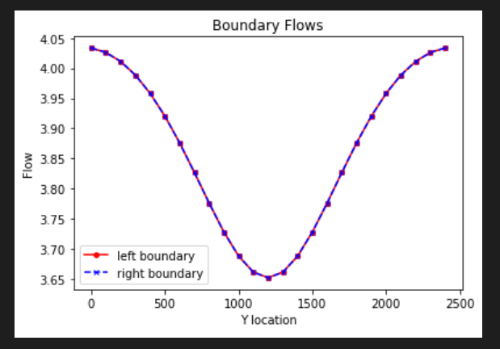
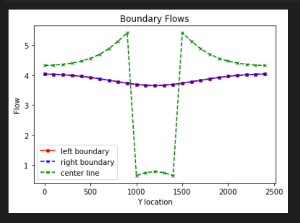

## Gillian Noonan
## HW 3 Challenge and Discussion Questions, Box Model- FloPy Exercise

## **Challenge:**
A flopy code is provided that recreates the 2D, heterogeneous model created manually in MODFLOW for the last exercise.  The code creates plots that show the grid, boundary conditions, 2D K distribution, steady state boundary fluxes, and steady state heads along a profile connecting the constant head boundaries.  It also includes a plan view map that shows both equipotentials and flow vectors.  

### Model Description
​The model provided is set up for a heterogeneous medium - a homogeneous medium with a centered, square low K inclusion.  

Dimensions:
- 25 by 25 by 1
- dx = dy = 100 m
- dz = 10 m

Subsurface Properties:
- Heterogeneous
- K = 1.0 m/day in x, y and z with a 5x5 inclusion with K = 0.1 m/day centered in the domain.
- Porosity = 0.35
- Specific yield = 0.3
- Storage coefficient=0.001

Boundary Conditions:
- Right boundary is constant head of 10 m relative to the datum, which is located at the bottom of the domain.
- Left boundary is a constant head of 20 m relative to the datum, which is located at the bottom of the domain.

### Noonan - Notes

 - Stuck on figuring out how to calculate the Keq(harmonic and mean) for Challenge #3.  I need a nudge.

-----------------------------------
**The Process and the Key Figures:**

I'm stuck on the challenge question 3 plots.   I am not understanding how and what data to use to calculate the Keq (harmonic or arithmetic).  See notes below for what I think I know.

*Figure 1: Base case boundary fluxes.*

*Figure 2: Base case boundary fluxes and flux through midline of domain.*

*Figure 3: Comparing 2D Keq with the area-weighted harmonic mean K.*

**Nothing yet - Stuck - Read below**

*Figure 4: Comparing 2D Keq with the area-weighted arithmetic mean K.*

**Nothing yet - Stuck - Read below**

-------------------------------------

### Noonan - Challenge Response

***1) For the initial values of background and inclusion K, plot the flow into the left and out of the right boundary.  (The code, as provided, makes this plot for you.)  Explain why the values are not constant along the boundary (relate to the definition of a Type I boundary).  Explain why the flow distributions are the same for the left and right boundaries.***
> Answer:     .....to be written

***2) Add a plot of the left-to-right flow along a line that passes through the center of the inclusion.  What can you learn from comparing this distribution to that seen on the boundaries?***
> Answer:   .....to be written

***3) Calculate the total flow into (and out of) the domain.  Use this to calculate the Keq of the heterogeneous system with the K values as given in the starter code.  Repeat this calculation for the following K values for the inclusion (keeping the background K as it is given):  0.01, 0.1, 1, 10, 100.  Compare the Keq to the harmonic and arithmetic mean K values based on the area occupied by each medium (rather than the length for a 1D system).  Can you draw any general conclusions about the impact of high or low K heterogeneities on the equivalent K for the flow system examined?***
> Answer:  Equivalent K represents a value that replaces a heterogeneous system with one overall value for k (i.e creates homogeneous representation where total flow through the system is same, boundary conditions remain the same).  For example, if you had a box with heterogeneities you could not see in, measure flow using boundary conditions - this K value will be same as if solved considering all heterogeneities.  "Equivalent homogeneous system, taken as a whole".

**How to calculate total flow in (and out)??** -

Starting point - I don't know exactly.  From the model plots of boundary flow, it looks to be around 4.   From my excel sheet calculations, I'm getting a value more near .004 at the boundary.

> ***From lecture tip from Ty:***
"Figure out what is total flow - we have flow into each cell - add up flow into each cell.  We know gradient, we know flow for an assumed homogeneous system, then what would K have to be to give that same flow for those same boundary conditions.  
Calculate the flow that's going into a cell and then repeat it 5 times."

So does this mean you add all of the q values for all of the cells in your matrix for the system?  Or just across one row or column?  or average across the boundary?  I don't understand the we "have flow into each cell".  Where?

**Things I Know or think I Know:**
> Right boundary is constant head of 10 m, Left boundary is a constant head of 20 m
- Gradient = dh/dl = 10/2500 = .004

>Total volume in/out = 94.8705L = 0.095 m^3
- I don't think this is relevant to this problem, but maybe?  Was peeking around at the water budget write-out to see if it sparked any ideas.

> Values to be plotted:
- K inclusion for trials 1 through 5 = 0.01, 0.1, 1, 10, 100
- K eq (harmonic) for trials 1 through 5 = ?????
- K eq (arithmetic) for trials 1 through 5 = ?????

> Formulas that might be relevant
- q = -K (dh/dl)
- Keq = (L1+L2)/((L1/K1)+(L2/K2)) = 2/(1/K1)+(1/K2)  

**What is q???**

> Not sure how to find flow into each cell?  I used my excel sheet from HW2 to get a matrices of q values for each model run, but having a hard time conceptualizing this whole question and understanding what all of the different K values even are, let alone how to calculate them.  I tried some calculations by summing q or averaging over the boundary, and solving for k, but I do not get the values you have plotted.

***4) Does the equipotential distribution depend on the absolute or relative K values for the background and the inclusion?  How would you use the model to test your answer?***
> Answer:

--------------------------------------

### Discussion Points
**In addition to The Challenge, start thinking about the following ideas:**

What are the implications for your results for representing K in a model cell, given that the distribution of K is always heterogeneous at the small scale?
> Initial Thoughts:

Discuss what it means to say that, for steady state flow, there are equivalent Type I and Type II boundary conditions.  How might this be useful in practice?
> Initial Thoughts:

How could you (or did you) use looping to answer The Challenge more efficiently?
> Initial Thoughts:

What are some advantages (easy) and disadvantages (harder) of using flopy rather than building MODFLOW models manually?
> Initial Thoughts:

What would you find if you altered your model to consider unconfined conditions??
> Initial Thoughts:
