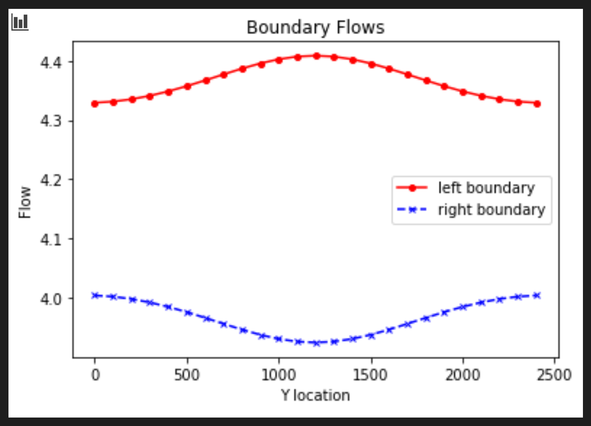

## Gillian Noonan
## HW 4 Challenge and Discussion Questions: Well, Well

## **Challenge:**
A FloPy code is provided to you that recreates the 2D homogeneous box model with constant head boundary conditions.  You will use this to explore the impact of a pumping well.

 1) For the initial well location, plot the flow into the left (constant head = 20) and out of the right (constant head = 10) boundaries.  (The code, as provided, makes this plot for you.)  Explain why the values are not constant along the boundary (relate to the definition of a Type I boundary).  Explain the shapes of the flow distributions and why they are not the same for the left (inflow) and right (outflow) boundaries.

 2) Add a series of the left-to-right flow along a line that passes through the center of the well [:,12].  How do you interpret the flow along this transect?  Hint, also look at the flow along a transect just upgradient from the well [:,11].

 3) Then, look at the plot of equipotentials and flow vectors.  Describe how water flows through the domain.  To aid in your description, draw a line through all of the flow vectors that terminate in the well.  This approximates the capture zone of the well. Use this to refine your description of the flow system, being as specific as possible about where water that ends up being extracted by the well originates on the inflow boundary.

 4) Then, look at the plan view drawdown plot.  Why aren't the drawdown contours circles?  Either explain why this is correct, or fix the plot.

 5) Move the well to [0,5,5].  Use all plots necessary to describe fully how water is flowing through the domain with the well in this location.  Be sure to include the drawdown plot in your discussion - compare this plot to the equipotentials and flow vectors.  Something is not right about how the well location is shown.  Fix it and explain what was wrong!!

### Model Description

- Homogeneous medium with a well pumping at a constant rate.  
- Well is located at [0,10,15]
- Well is withdrawing water at a rate of -8 (note, the rate is negative to indicate water being removed from the domain).  
- You need to:
  - move the well to the center of the domain [0,12,12] and change the rate to -10.  
  - modify the location of the domain and examine the impacts on flow across the boundaries and the steady state head and drawdown distributions.    

### Noonan - Notes

 - ...

 **Things I Know or think I Know:**
 > ...

-----------------------------------
**The Process and the Key Figures:**

...

*Figure 1: Base case boundary flows.*

well at [0,12,12]

*Figure 2: Base case boundary fluxes and flux through midline of domain.*

flow along a line that passes through the center of the well [:,12]

flow along a transect just upgradient from the well [:,11]

*Figure 3: Base case equipotentials and flow vectors.*

*Figure 4: Base case drawdown around centered well - simply python plot.*

OK, we're stepping it up a notch this week.  You will be given the correct plots for the questions related to the well located at [0,12,12], but not for the second well location.

*Figure 5: [0,5,5] boundary fluxes and flux through midline of domain*

*Figure 6: [0,5,5] equipotentials and flow vectors.*

*Figure 7: [0,5,5] drawdown around centered well - simply python plot.*

-------------------------------------

### Noonan - Challenge Response

***1) For the initial well location, plot the flow into the left (constant head = 20) and out of the right (contant head = 10) boundaries.  (The code, as provided, makes this plot for you.)  Explain why the values are not constant along the boundary (relate to the definition of a Type I boundary).  Explain the shapes of the flow distributions and why they are not the same for the left (inflow) and right (outflow) boundaries.***
> Answer:     .....

***2) Add a series of the left-to-right flow along a line that passes through the center of the well [:,12].  How do you interpret the flow along this transect?  Hint, also look at the flow along a transect just upgradient from the well [:,11].***
> Answer:   .....

***3) Then, look at the plot of equipotentials and flow vectors.  Describe how water flows through the domain.  To aid in your description, draw a line through all of the flow vectors that terminate in the well.  This approximates the capture zone of the well. Use this to refine your description of the flow system, being as specific as possible about where water that ends up being extracted by the well originates on the inflow boundary.***
> Answer:  ...

***4) Then, look at the plan view drawdown plot.  Why aren't the drawdown contours circles?  Either explain why this is correct, or fix the plot.***
> Answer: ...

***5) Move the well to [0,5,5].  Use all plots necessary to describe fully how water is flowing through the domain with the well in this location.  Be sure to include the drawdown plot in your discussion - compare this plot to the equipotentials and flow vectors.  Something is not right about how the well location is shown.  Fix it and explain what was wrong!!***
> Answer: ...
--------------------------------------

### Discussion Points
**In addition to The Challenge, start thinking about the following ideas:**

You are still modeling steady state conditions?  So, what is supplying water to the well?  Why are the drawdown contours not equally spaced?
> Initial Thoughts: ...

If the right boundary represented a stream, what would the impact of the well be on the stream?  This is referred to as 'capture' - can you describe this concept in a sentence that a non-expert might understand?
> Initial Thoughts: ...

Before running the model, predict what you would happen to the inflow/outflow boundary fluxes if you reduced the pumping rate to -5 with the well located at [0,12,12].  Were you correct?  If not, how were you wrong? Now predict what would happen if you increased the pumping rate to -20.  Still correct?  Now try -25.  Uh oh, what happened??
> Initial Thoughts: ...
