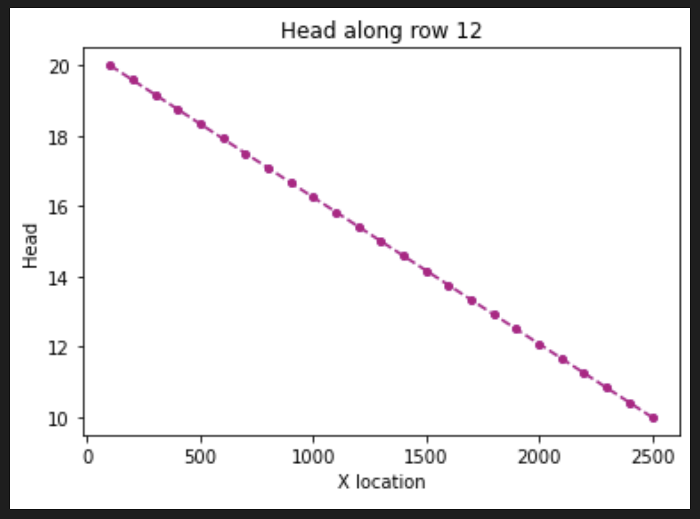
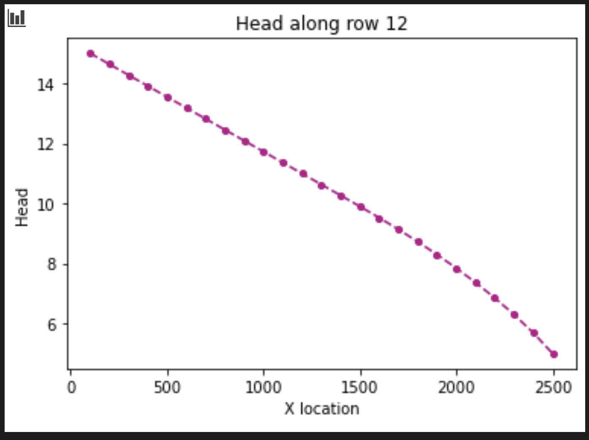
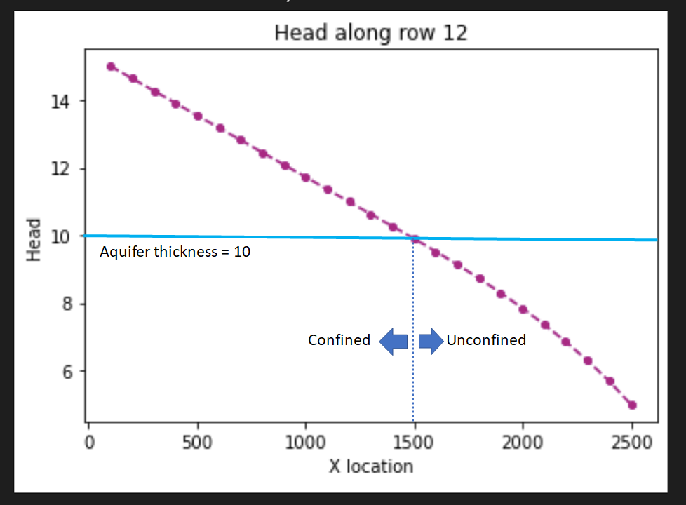
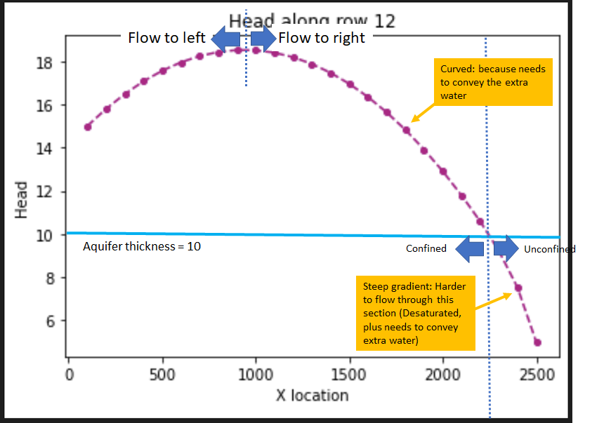
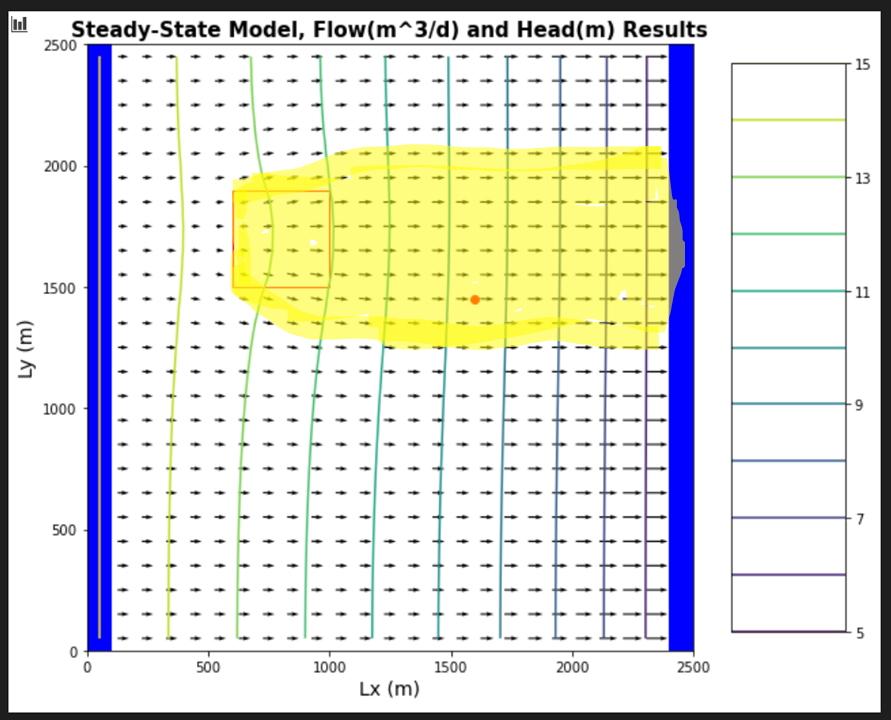
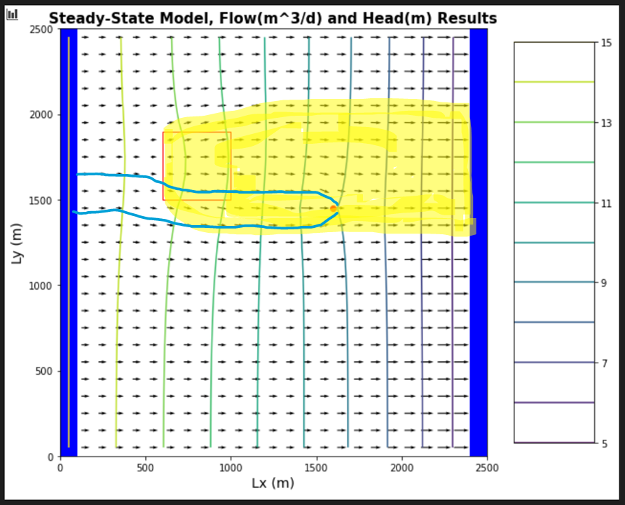
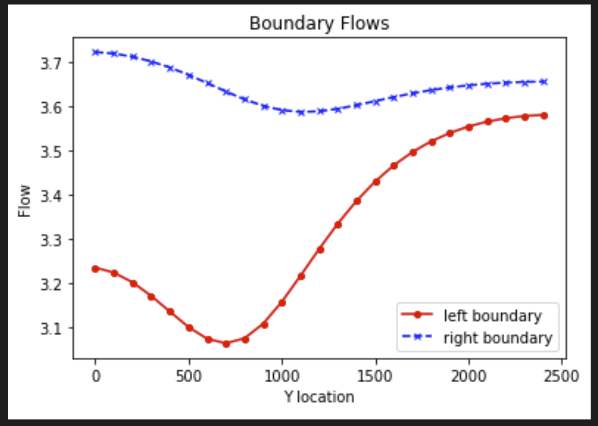

## Gillian Noonan
## HW 5 Challenge and Discussion Questions: Recharge Me

## **Challenge:**
A flopy code is provided that recreates the 3D homogeneous box model with constant head boundary conditions.  The aquifer is now defined as unconfined - it was confined for the BoxModel simulations and the recharge package has been added.  Use this to explore the impact of recharge into an unconfined aquifer.  

### Model Description
Initial conditions:
- Homogeneous medium.  
- Unconfined aquifer, recharge package added.
- Well is located at [0,10,15] - well not pumping
- Recharge rate is 0.
- Left and right constant head boundaries = 20, 10

You need to modify the model to:
  - Reduce boundary heads to 15 and 5.  
  - Add recharge at a constant rate of 1e-4 m/day over the entire top boundary.  
  - Model a system with zero recharge except for a farm located in [6:10, 6:10] - in python terms.  Recharge beneath the farm is 1e-4 m/day due to excess irrigation.  
  - Start the well pumping at a rate of 8 m3/day.  

### Noonan - Notes

Notes on Recharge with MODFLOW
  - Recharge is flux of water across the water table.  Recharge = P-ET (for steady state).
  - unconfined aquifer conditions are what makes sense for recharge (convertible cells in MODFLOW - convert between confined and unconfined on the fly)
  - Change head to 15 and 5
    - slope will be the same: gradient same, K same, same flow through system. However - aquifer thickness is 10.  Second case will have an unsaturated zone.  
    - Gradient on right needs to be steeper to account for flow, so gradient becomes curved across the model instead of constant decrease.
  - In the two cases of (20, 10) and (15, 5):
    - K is same, gradient is decreased in (15,5), so flow must also be decreased.  Transmissivity is changing because saturated thickness is changing.
    - For (15, 5) , Complicated because part of aquifer is confined, other part is unconfined.   The top portion will be linear because it's still confined (full of water to thickness of layer), then becomes non-linear at water table, where slope continually increases to boundary because thickness is continually decreasing (unsaturated portion).  Rate of decrease depends on head needed to establish the steady-state flow.

For model with confined and unconfined zones:
  - Equipotential surface at water table, where head is zero, acts as no-flow boundary.  For MODFLOW to handle it, it converts the cell (thickness of layer to closest layer thickness dependent on water table elevation (for unconfined aquifer).   
  -  It's a Non-linear problem: "Circular Solution - must get there iteratively".  Don't know water level until solve flow problem, don't know how to solve flow problem until we know what the thickness is.  Have to guess water table elevation, solve flow problem for that distribution of transmissivities.   Check - do we end up with head distribution that we assumed to start with?  If no, adjust head and solve again until head distribution gives us the transmissivity that, coupled with that head distribution or gradient, ends up in steady state flow conditions.

Recharge effect on head -
  - reduced gradient on left (less water in ) -  increased gradient on right (more water out), ponded water so saturated thickness is higher.  
  - size of curve depends on how much water is being added. Enough water can even change direction of gradient (push out both sides).

-------------------------------------

### Noonan - Challenge Response

***1) For the initial boundary head values and pumping and recharge rates, compare the head versus x distance - along a transect from the middle of one constant head boundary to the other - to the results for the BoxModel.  Now reduce the boundary heads to 15 and 5.  Compare this result and explain any observed differences.  The overall gradient is the same, as is the K of the medium ... is the flow the same for both boundary conditions?  Why or why not?***
> Answer:

>For initial boundary head values and pumping and recharge rates, the starting well is zero pumping and recharge is 0 - in this way, it equals the basic homogeneous box model simply with constant head values of 20 on the left and 10 on the right.

constant head boundary of 20, 10

> After reducing the heads to 15 and 5 and comparing the plots (see below), the noticeable difference is that the 15,5 plot shows some curving towards the left side of the plot - the gradient is no longer linear.  

constant head boundary of 15,5

> In the two cases of (20, 10) and (15, 5): K is same, then gradient is decreased, so flow must also be decreased.  Transmissivity is changing because saturated thickness is changing.  Aquifer thickness is 10.  So, the second case (15,5) will have an unsaturated zone.  Flow only takes place through the saturated part of aquifer.  Aquifer thickness is cut in half - so transmissivity is also halved.  On the right hand side, it's harder for water to flow through (unsaturated zone/unconfined), but the same amount needs to flow through to maintain steady state conditions.  Therefore, the gradient on right needs to be steeper to account for flow, but still needs to meet point 15 on left and 5 on right for constant head conditions. thus, the gradient becomes curved across the model instead of constant decrease like in the 20,10 condition (fully saturated/confined).

***2) Now add recharge at a constant rate of 1e-4 m/day over the entire top boundary.  Explain the head transect and boundary flows.  Is flow in this system 2D or 3D?  Is it represented as 2D or 3D?  Explain what you mean by your answers.***
> Answer:   Adding water across the entire top boundary is reflected in the head gradient plot as reduced gradient on left (less water in) and increased gradient on right (more water out) in order to maintain the steady state and constant head boundary conditions.  

> The flow in this system is 2D because now we have water flowing both down from the top and to left and right across the profile, however, I believe per lecture that MODFLOW represents this as 1D flow per cell, as it converts the cell, based on the thickness of the nearest saturated zone, simply to 1D flow at an elevation representing the water table?

***3) Now model a system with zero recharge except for a farm located in [6:10, 6:10] - in python terms.  Recharge beneath the farm is 1e-4 m/day due to excess irrigation.  First, calculate the annual excess irrigation, in meters, that has been applied to the farm.  Second, assuming that the crop is cotton, it is located in southern Arizona, and cotton is grown all year (for simplicity), calculate the total irrigation rate on the farm that would be associated with this amount of excess irrigation.  Finally, identify the area within the domain that might be subject to contamination if the recharge water was somehow tainted.***
> Answer:  Annual excess irrigation per year in meters = 1e-4 m excess irrigation/day x 365 day/yr = .0365m/yr

> If crop is cotton, and grown in AZ, total irrigation rate on farm would be found via the relationship:
 >> Total irrigation + total rainfall - cotton plant uptake - evaporation = excess recharge

> To identify the area within the domain that may be affected by contamination, one should follow the flow lines entering into and then out of (now contaminated) the irrigation zone.  The below plot highlights the potentially affected zone.

***4) Lastly, start the well pumping at a rate of 8 m3/day.  Using one color, identify the capture zone of the well.  Using a second color, show the area that might be contaminated by the irrigated farm fields.  Comment on the impact of the well on the pattern of potential contamination.***
> Answer:  The plot below shows again the potentially impacted zone from irrigation on the farm, and the flow lines going to the well that is pumping at a rate of 8m3/day.   It can be seen that the two shapes overlap, indicating potential contamination in the well from the agricultural field excess recharge.  The flow lines can be seen bending toward the well, indicating that it may pull some of the contaminated water that would have traveled further to the right.   In this way, it could act as a reducing factor to overall subsurface contamination.

***5) Additional request during 2/16 lecture:  Estimate the contamination concentration at the well given the capture zone area and the portion of the farm field it is pulling from***

> I get the primary concept here that the water ending up in the well will be a mix of that fresh water coming in from the left boundary capture zone, and the portion of the water that overlaps with the contaminated zone, to result in some different concentration of contamination based on amount of flow in from each source (mixing), which will be dependent on flow rate and area flow is applied over.   However, finding and applying the info to calculate this is another story....

> The farm is 400x400m = 160,000 m2. The recharge rate is 1e-4 m/day.  So the flow would be 160000x1e-4 = 16m3/day??

> However, we are only overlapping with approximately 1/6 of that area for the well capture zone (~27,000m2), so the flow contribution to the well would be 16/6 = ~2.7m3/day?

> Then, from the model results, the flow in at the left boundary within the capture zone is approximately 3.4 at y=1500m (m3/day?? what are units? would be good to have those on the plot in python).  Let's estimate that total area for the inflow zone to be 250x10m = 2,500m2, which is significantly smaller area than the recharge zone.   However, the flow is much larger.   I'm not really sure how to relate that 3.4 value to the assumed area, like what is that 3.4 actually representing spatially??

Boundary flows for farm focused recharge and well pumping at -8

--------------------------------------

### Discussion Points
**In addition to The Challenge, start thinking about the following ideas:**

How can MODFLOW, which does not model unsaturated flow, represent an unconfined aquifer?
> Initial Thoughts:  With a type 2 boundary at the top of the water table??  Like a flux through?

>>Second thoughts:  I think now that it just represents it as either 1D flow across a cell at the highest elevation of the water in that cell?

What do you think would happen (in MODFLOW) if you pumped an unconfined aquifer so hard that the water level dropped below the bottom of the aquifer?  Explain this from the point of view of what is happening in the model ... then think about what would happen in real life!
> Initial Thoughts: These are hard questions, whoa.  In MODFLOW, if the water level dropped below the bottom of the aquifer, wouldn't that be zero flow?  like no water available to pump??  So it would look like pumping a dry unit perhaps, whatever that looks like?  I'm not sure i really understand conceptually here what is happening when pumping an unconfined aquifer actually results in the water dropping below the bottom of the aquifer, how is that even physically possible?

>> Second thoughts: I still have no idea!

How will the steady state capture zone of a model with recharge differ from that in the same model without recharge?
> Initial Thoughts:  The capture zone of a model with recharge vs a model without recharge - well, firstly, the model with recharge has more water available to capture, so there will be less effect on the outflow balance?  But overall, the size of the capture zone should not change since it is dependent on the pumping rate and not the available water supply??

>> Hmmm, i think i still stand with my original thoughts.

What is recharge?  What does it mean to define recharge for a MODFLOW model?  How is it related to defining ET and precipitation?  Where, exactly, is the top boundary of the model?
> Initial Thoughts:  Recharge is flux of water across the water table.  Defining recharge for a MODFLOW model means adding a rate and area of distribution for this additional flow coming from the top of the model.  Recharge is related to ET and precipitation (P) by the fact that Recharge = P-ET (for steady state).  The top boundary of the model is at the top of the uppermost layers of cells in your model domain?

>> Second thoughts: modflow defines recharge as simply an additional water amount per cell?     
