## Gillian Noonan
## HW 6 Challenge: Transpired

## **Challenge:**
A flopy code is provided that recreates the 3D homogeneous box model with constant head boundary conditions.  The aquifer is now defined as unconfined.  Use this to explore the combined impacts of recharge, ET, and pumping on an unconfined aquifer.

### Model Description
Initial conditions:
- Homogeneous medium.  
- Unconfined aquifer, recharge package added.
- NEW WELL LOCATION: Well is located at [0,15,15] - well not pumping
- Background recharge rate is 0.  There is a region of localized recharge in [6:10, 6:10] - in python terms - with a recharge rate of 5e-4 m/day
- ET occurs over the entire domain at a rate of **5e-5** m/day and an extinction depth of 3 m.
- Left and right constant head boundaries = 15, 5

You need to:
- Show equipotentials and flow vectors, and plot of steady-state ET flux (how is ET varying over the map) for initial conditions.  
- One person to play around with extinction depth and see what difference that makes in the model.
- Other person to explain conceptually the difference between how ET is being modeled in MODFLOW versus how it works in real life
- Collective final challenge, start the pumping and examine how pumping affects ET in the MODFLOW model.  If we know the well's pumping rate and how much water is coming in from infiltration and from the boundary, how do we include ET in the mass balance of the well. Give a complete mass balance for the well that includes all sources of water, including boundary, irrigation water (recharge) and how you account for ET.

### Noonan - Notes

- Evaporation:
  - Evap from subsurface - how does it change with depth?  Max potential evap at ground surface and decreases with depth - harder to evaporate deeper because lower temperature.   Soil is very humid (~99 relative humidity in most cases).  Deeper in the soil, there is essentially no evaporation, it drops off very sharply at the surface.  This is in real life - however, MODFLOW just assumes it decreases linearly with depth.  
  - Extinction depth - no evaporation below that depth.  Serves as a cutoff for MODFLOW to apply evaporation to cells - below that depth, no evap applied to cell.  
  - "how much water is leaving your domain by evaporation - domain starts at the water table"
  - confined aquifer - no evaporation at all
  - How to put in MODFLOW model:  Roll it all into recharge value (precip, evap, transpiration, etc.) - MODFLOW only does groundwater - all of this stuff happens above the boundary of our model, so we have to do that calculation off to the side.

- Transpiration:
  - How to represent in subsurface model? Represent the root to soil continuum, the roots are outside of your domain.  The boundary condition would be water flowing out of soil into root.   To represent, would need to define constant pressure head, known pressure head, or known flux for EVERY ROOT.  This is not reasonable for a basin-scale model.  Instead, we use sink term to represent all plants in model per cell - either per time step, or every time-step for steady-state, we define how much water goes into the roots - in MODFLOW this is diffuse throughout the cell, water magically disappears.
  - How this uptake should be applied? Change in rate with depth - MODFLOW again uses extinction depth and transpiration rate is linear with extinction depth.  So we set a transpiration rate for plants, set an extinction depth, and below that there is no transpiration.  Basically we are modeling tap roots (what is taking water from the system).
  -  Reasons to be wary of this representation in models: Values depend on model resolution - get to pick one number for your model.  Does not mimic actual root density per depth - not linear in real life.  Root uptake depends on water pressure (degree of wetness or dryness in soil).

-   MODFLOW Evapotranspiration package: https://water.usgs.gov/ogw/modflow/MODFLOW-2005-Guide/index.html?evt.htm
   - The Evapotranspiration package is used to simulate a head-dependent flux out of the model distributed over the top of the model and specified in units of length/time.  Within MODFLOW, these rates are multiplied by the horizontal area of the cells to which they are applied to calculate the volumetric flux rates.
   - Recharge is sometimes calculated as precipitation minus losses between the land surface and the water table. Evapotranspiration from the unsaturated zone would be one such loss.
    - ET variables (ET surface, maximum ET rate, and extinction depth) are specified in layer variables, SURF, EVTR, and EXDP, with one value for each vertical column. Accordingly, ET is calculated for one cell in each vertical column. The option codes determine the cell within a column for which ET will be calculated.

      -	1—ET is calculated only for cells in the top grid layer.
      -	2—The cell for each vertical column is specified by the user in variable IEVT.
      -	3—Evapotranspiration is applied to the highest active cell in each vertical column.

### The Process and Key Figures

#### Team partner: Dalia

Sunday discussion with Dalia:

I led the discussion for the conceptual idea of how evaporation and transpiration occur in real life, and how MODFLOW models these things.   We used my above notes as a starting point.  In summary, we agree that MODFLOW is a very general representation of these events and that the model will never accurately represent the fine tuning of real life ET processes.  

Dalia led the discussion on how changing the extinction depth affects the model results.  We tested a number of values.  Tested 0 - model did not converge.   Discussed "what do you think is the smallest number that would work for the model?""  We thought anything larger than zero.  So we tried .001, It still did converge!  Thought maybe the model needs to have the numerical format different, so we tried 5e-5.  No go.  Thought model needs an integer, so we tried 1.  This worked.  We also tried 3, 5, 10 and 15 and looked at resulting plots of head, ET distribution, and flow distribution.  We discussed how the gradient changed for ET over the models with different extinction depths and how this might relate to the discussion on head gradient from HW5 with the change from confined to unconfined parts of the model with heads at 15,5 and aquifer thickness of 10.

We then discussed number 3 and talked about how to calculate flow over an area and arrive at Darcy flux values.   We agreed to work on this on our own and check back Monday afternoon/evening.

Monday update:  Discussion continued on Slack.  Jill was feeling very depleted from her second COVID vacc shot!

#### Key Figures

FIG 1. Flow along fixed-head boundaries for initial conditions

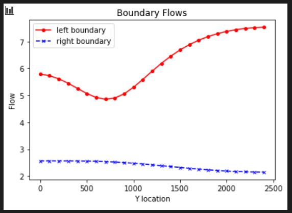

FIG 2. Equipotentials and flow vectors in plan view and outlined area affected by recharge

FIG 3. Steady-state ET flux (how is ET varying over the map) for initial conditions (Extinction depth = 3)

FIG 4. Equipotentials and flow vectors in plan view and outlined area affected by recharge + Pumping

-------------------------------------

### Noonan - Challenge Response

***1) For the initial boundary head values and recharge and ET rates, establish the flow versus y-distance along the left (15 m) and right (5 m) boundaries.  Plot the equipotentials and flow vectors in plan view and outline (hand draw) the area that would be affected by recharge (i.e. if it were contaminated).  Also show a contour plot of the steady state ET flux in plan view.***
> Answer:
See Key figures 1, 2 and 3 above.

***2) Change the extinction depth.  What impacts does this have?***
> Answer:  The extinction depth represents the depth below which NO evaporation is applied to the cells.  Since the ET rate is 5e-5 all over the top of the survey area, I would not expect this to have an effect in a fully saturated, homogenous medium.   However, we have a gradient that goes across our profile, from 15 to 5, and our aquifer thickness is 10.   Perhaps, similar to the discussion from HW5, we will see an effect where the profile crosses that threshold from confined to unconfined in the model?

Initial conditions:

FIG 5a,b and c. Steady-state ET flux, Plan View Head Contours, and Flow for Extinction depth = 3

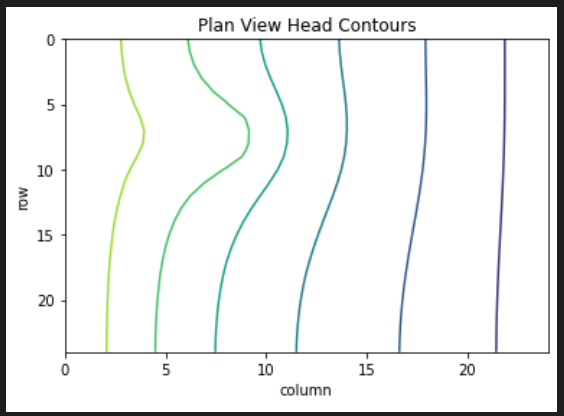
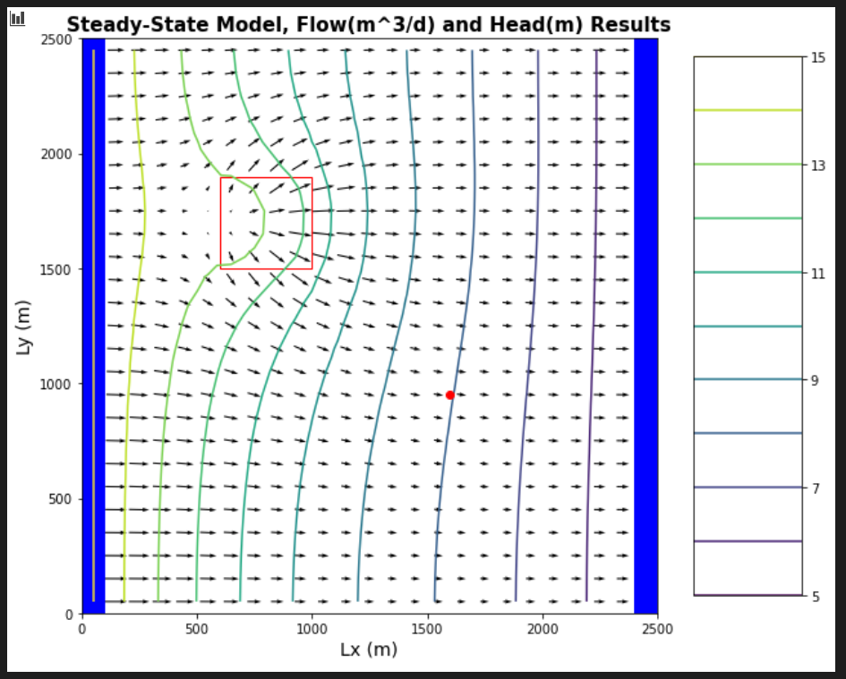

Changing the extinction depth to 1 (shallower): (by the way, we tried values less than 1, as well as 0, and the model fails to run).

The primary change observed is that the gradient of ET flux across the model get steeper in the area of 10-12 (high rate of change in this area).  The head contours show some change, but minimal, and the flow vectors look much the same.

FIG 6a,b and c. Steady-state ET flux, Plan View Head Contours, and Flow for Extinction depth = 1

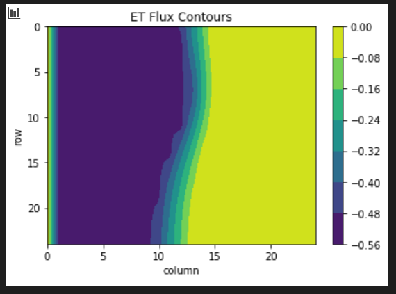

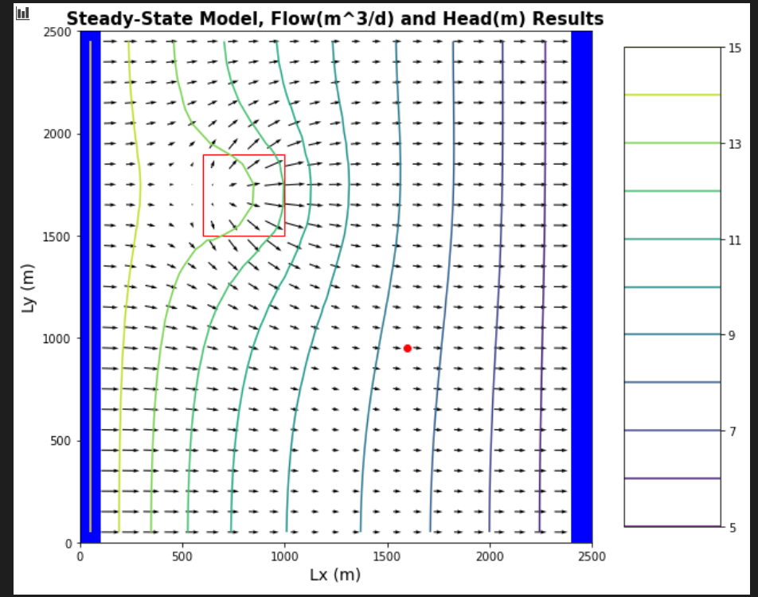

Changing the extinction depth to 5 (deeper):

The primary change observed is that the gradient of ET flux across the model get shallower in the area of 10-25 (more ET across the columns).  The head contours look same if not highly simiilar, and the flow vectors appear to be getting smaller now towards the right boundary.

FIG 6a,b and c. Steady-state ET flux, Plan View Head Contours, and Flow for Extinction depth = 5

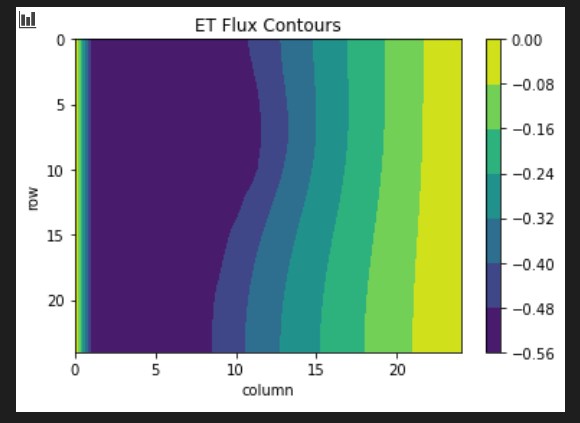
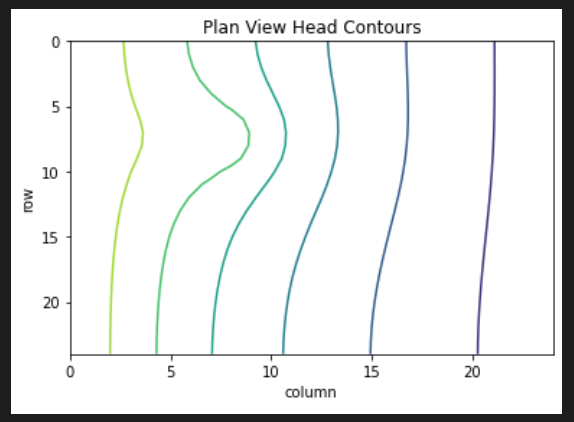
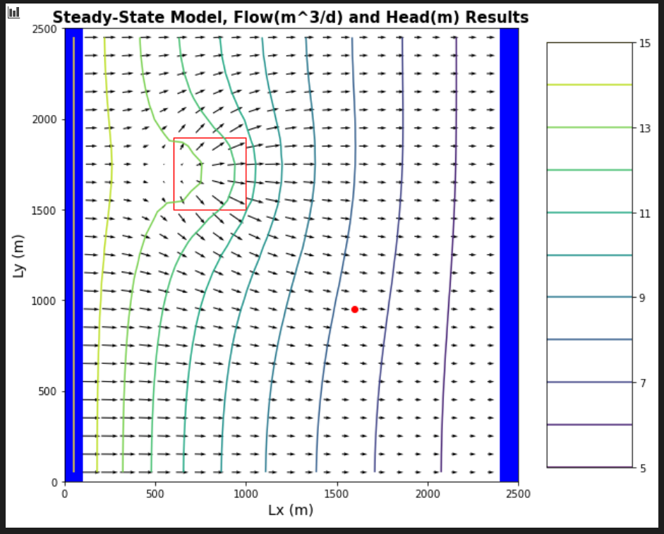

Changing the extinction depth to 10 (deeper yet - at bottom of aquifer now):

The primary change observed is that the gradient of ET flux across the model gets even shallower in the area of 10-25 (more ET across the columns).  The head contours look slightly bent from previous trials, and the flow vectors are getting very small now towards the right boundary.

FIG 7a,b and c. Steady-state ET flux, Plan View Head Contours, and Flow for Extinction depth = 5

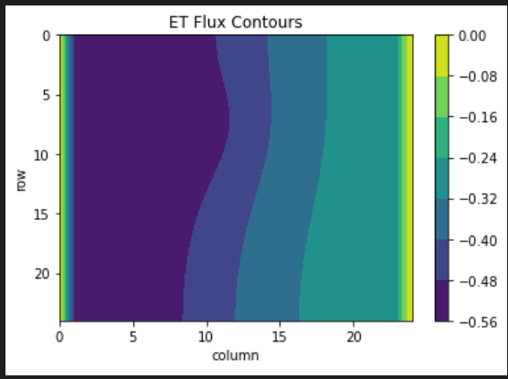
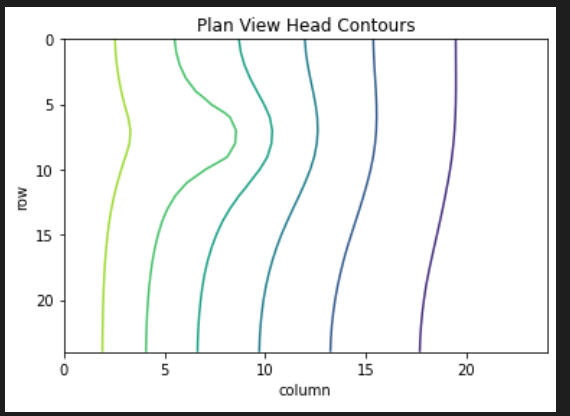
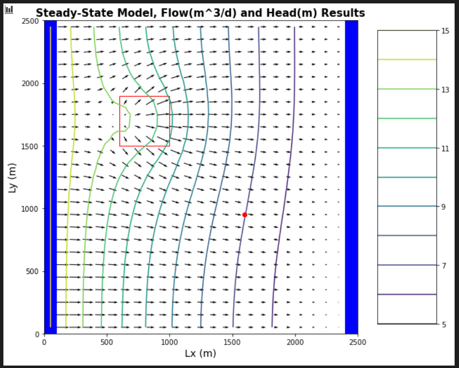

***3) Explain, conceptually, how MODFLOW is representing ET.  How does this compare to your intuitive understanding of ET in the real world?***  
> Answer:  

>MODFLOW assumes ET decreases linearly with depth.  To represent ET in MODFLOW, you give the model 3 variables representing ET surface, ET rate, and extinction depth (depth below which no ET applied to cells).  These layer variables are SURF, EVTR, and EXDP, and are assigned one value per vertical column.  The Evapotranspiration package is used to simulate a head-dependent flux out of the model distributed over the top of the model and specified in units of length/time.  Within MODFLOW, these rates are multiplied by the horizontal area of the cells to which they are applied to calculate the volumetric flux rates.

> In the real world, the maximum potential evaporation is at ground surface and decreases with depth very sharply, Not linear, but is dependent on variable such as temperature (which decreases sharply with depth, making evaporation harder, vapor pressure, and soil moisture content).  Similarly, in the real world, transpiration is not linear with depth.   Root uptake depends on factors such as root density per depth, and water pressure.  

***4a) Now start the well pumping, extracting 20 m3/day.  How does the well change the zone that is affected by the recharge area?  How does it affect the ET map?  Write a mass balance for the well - how much water is coming from a boundary?  How much is originating as recharge?  How do you account for the impact of ET on this mass balance?  At steady state, what are the effects of 'capture' by the well?***
> Answer:  See key Figure 4 above for zone affected when well starts pumping.  See Figure 7 below for how affects the ET map.  The ET is reduced at the location of the well, as observed by the bend towards yellow (less ET) in that area of the well.  I would think that this would be indicative of less water available for ET since the well is taking it our of the system in this zone.   Also, it is creating a negative pressure, or pull, which may affect the ability of the water to move upward and out?

FIG 7a,b and c. Plan View Head Contours, Plan View Drawdown and Steady-state ET flux, for Extinction depth = 3 and Well Pumping at -20.

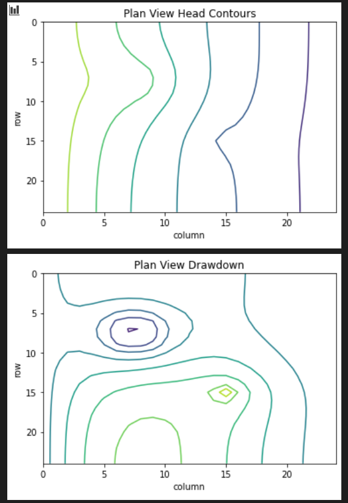
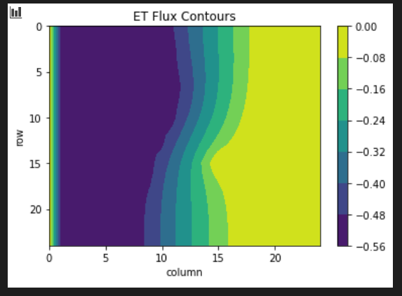

***4b) Write a mass balance for the well - how much water is coming from a boundary?  How much is originating as recharge?  How do you account for the impact of ET on this mass balance?***
>Mass balance: The Evapotranspiration package is used to simulate a head-dependent flux out of the model distributed over the top of the model and specified in units of length/time.  Within MODFLOW, these rates are multiplied by the horizontal area of the cells to which they are applied to calculate the volumetric flux rates.  This leads me to believe that an area calculation over the capture zone is the best approach.

Q(well) = Q(boundary) + Q(recharge) - Q(ET)

> Q(well) = 20m3/d, which was given.

>Q(boundary): can be determined by summing all of the flow values over the extent of the y axis which captures the well capture zone, or flow into the well from the left boundary. Based on the boundary flows plots, and a y extent of ~ 700-1700m, or 1000m x 10 m = 10,000m2.  Summing flow values over this length, I would estimate this flow through this area to be approximately 60m3/d.  

> Q(recharge): The farm is 400x400m = 160,000 m2. The recharge rate is 5e-4 m/day.  So the flow would be 160000x5e-4 = 80m3/day for the whole farm.  However, we are only overlapping with approximately 1/6 of that area for the well capture zone (~27,000m2), so the flow contribution to the well would be 80/6 = ~13m3/day

> Q(ET): ET can be thought of as a reduction in the recharge and flow-in rates, applied to the area that the well is pulling from (i.e. the capture zone).   I will consider it in two parts.  In this case, we determined that the estimated area of the farm that the well is pulling from is ~27000m2.   With an ET rate of 5e-5m/d, the ET reduction would be the product of these two numbers, or ~ 1.35 m3/d. Similarly, I will very roughly estimate the non-farm "freshwater" capture zone of the well to be 1e6 m2.  ET loss over this area will be the product of that value and ET rate, which would be 50m3/d.  

So how did i do with my estimations?

Q(well) = Q(boundary) + Q(recharge) - Q(ET)

20 = 60 + 13 - 51 = 22

This method of estimating is close, but is off by only 2 flow units, all due to rounding and estimating areas.   Not too bad, I think.

***4c) At steady state, what are the effects of 'capture' by the well?***

>At steady state, Qin = Qout, so if the well is capturing some of the water, more needs to be added to the system to replace that which would have left via the right boundary.  A well pulling water changes the mass balance of a steady-state system.  
--------------------------------------
