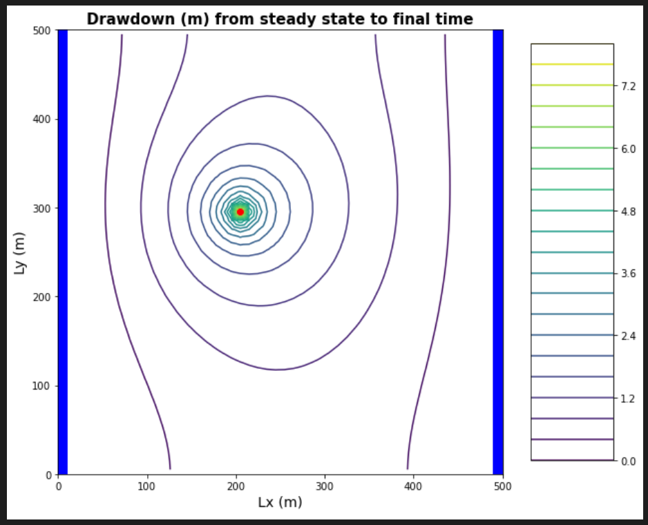

## Gillian Noonan
## HW 7 Challenge: Transients

## **Challenge:**
A flopy code is provided that simulates flow in a single layer model.  There is a well in the domain and uniformly distributed recharge.  There is no ET.  The aquifer is unconfined.  Use this to explore the response of an aquifer to time-varying pumping.    

### Model Description
Initial conditions:
 - homogeneous medium.  
 - single-layer domain, 50x50 cells
 - cells are 10 m in lateral extent and 50 m in vertical
 - well located at [0,20,20] (layer, row, column)
 - recharge at 5e-4 m/day
 - left and right boundaries have constant heads of 50 and 30, respectively
 - well is pumped cyclically: water is withdrawn at 500 m3/day for 90 days and then it is turned off for 270 days.  (Pretend that a year is 360 days long.)  The simulation is set to run for 100 years.  

### The Process
- First need to check through the "messed with" code and make sure to adjust all of the variable to match what they should be.
- Errors to note:
  - Per Slack - use Challenge versus what is in header of
  - Per Slack - use K value of 1
- Things I changed:
  - 3.2 - sim_years = 20 to sim_years = 100
  - 4.2 - H_init[:, :, :] = 50 to H_init[:, :, 0] = 50
  - 4.2 - H_init[:, :, 0] = 10 to H_init[:, :, -1] = 30
  - 8.1 - Q2 = 500 to Q2 = -500
  - 9.1 - recharge = 1e-5 #m/day to recharge = 5e-4 #m/day
  - 9.1 - rech_zone[10:20,10:20] to #commented out since recharge all over.

### Key Figures

Fig a) left panel showing the head at the well and right panel showing the head at the midpint of the domain, both as functions of time over the entire simulation.

Fig b)  The head along a transect between the constant head boundaries through the well at three times: the initial steady state; the final pump-on period; and the final pump-off period.

Fig c) A contour map with flow vectors at three times: the initial steady state; the final pump-on period; and the final pump-off period.

Fig d) A contour map of the drawdown calculated for two periods: between the initial steady state and the final  simulation time and between the final pump-on period and the final pump-off period.

### Noonan - Lecture Notes

-------------------------------------

### Noonan - Challenge Response

***a) The gradient is not uniform for the initial steady state conditions - discuss the influences of recharge and the unconfined condition on this nonlinearity***
> Answer:

***b) Determine if the system has reached steady state - consider a point at the well and another at the center of the domain.***
> Answer:  

***c) Find the zone of influence of the well defined in two ways:
    - Based on the drawdown from the initial steady state to the end of simulation time (end of final no-pumping stress period).
    - Based on the drawdown from the end of the last pump-on stress period to the end of simulation time.***  
> Answer:  

***d) How long does it take a point at the center of the domain to reach steady state.  At that point, explain how you could divide the domain into a steady and transient part and solve each separately.***
> Answer:  

***e) Find a constant pumping rate (same throughout the year) that matches the head time series at the middle of the domain.***
>Answer:

***f) Find a constant pumping rate (same throughout the year) that matches the head time series at the well, leaving only a regular, repeating seasonal residual.  Are the two pumping rates the same?***

>Answer:

***g) Discuss the sources of water captured by this well.  If you're up for a challenge, calculate them for the final pump-on period!***

>Answer:

***h) Discuss how you would define the capture zone of the well.  How is it different than our definitions of capture zone so far in the course?***

>Answer:
--------------------------------------
