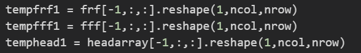
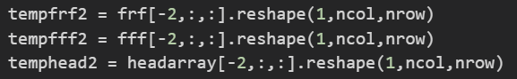
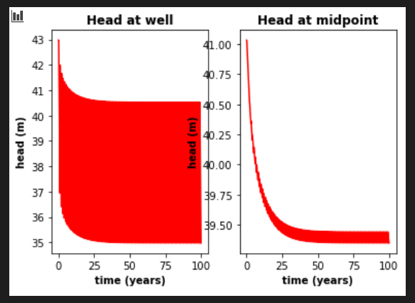
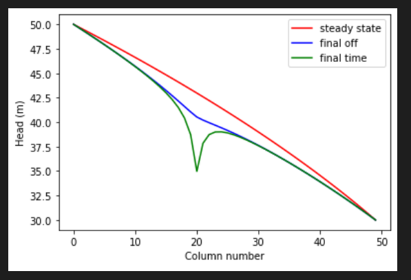
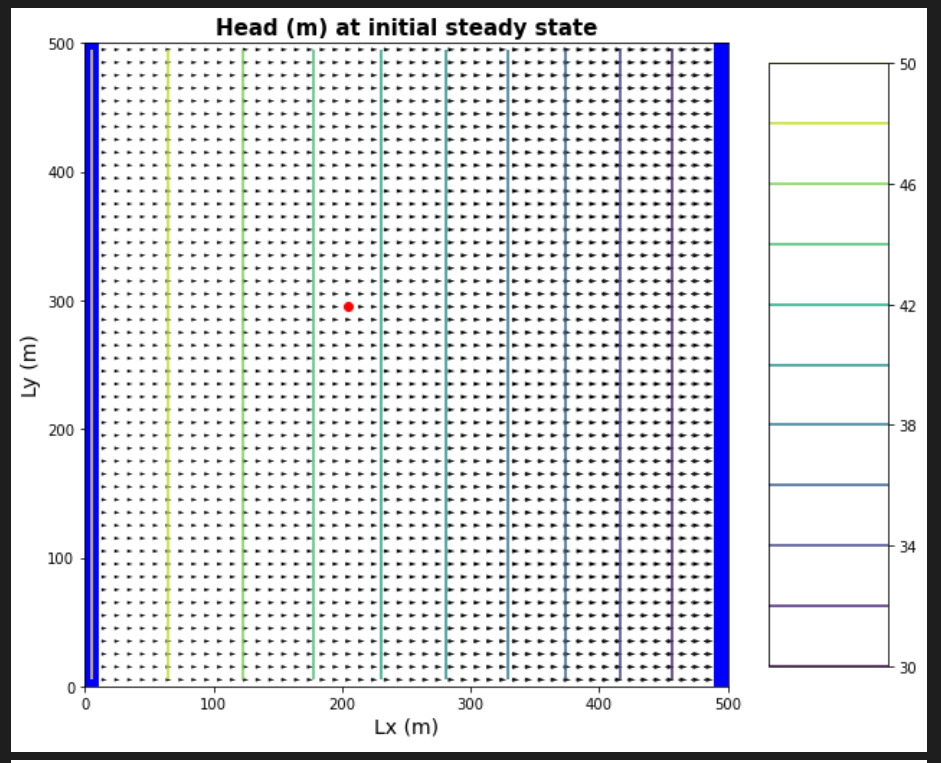
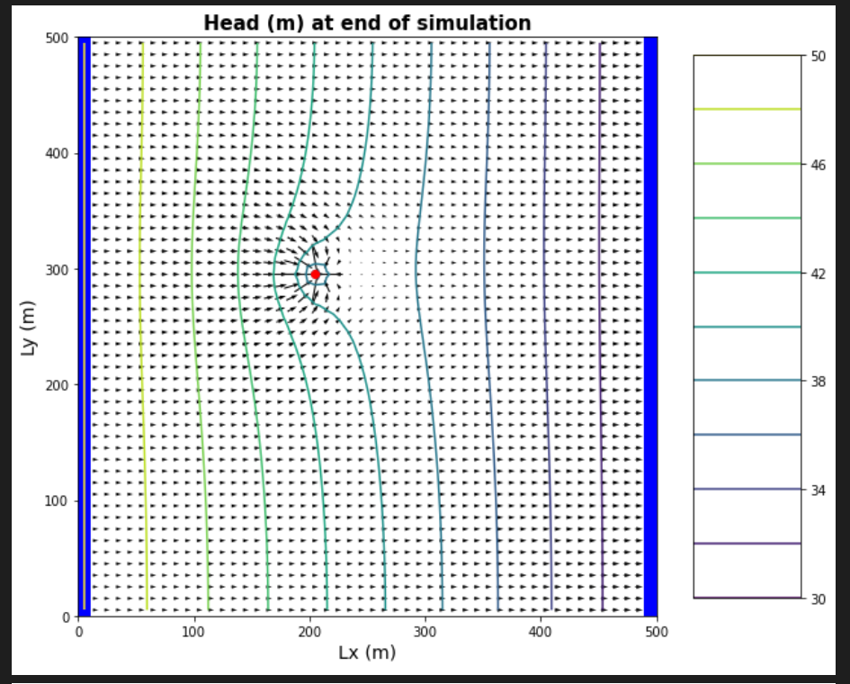
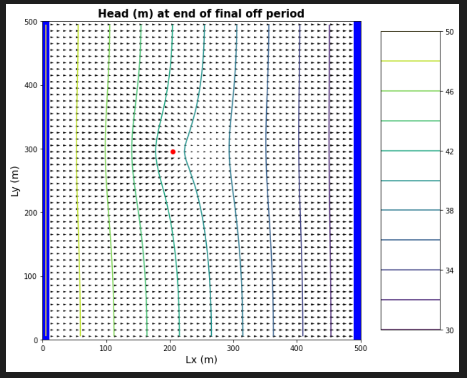
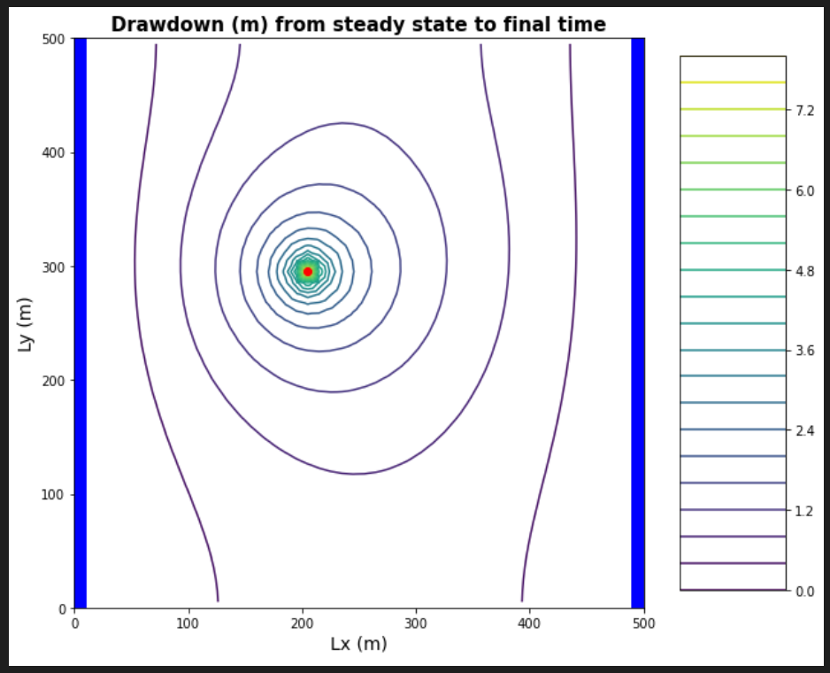
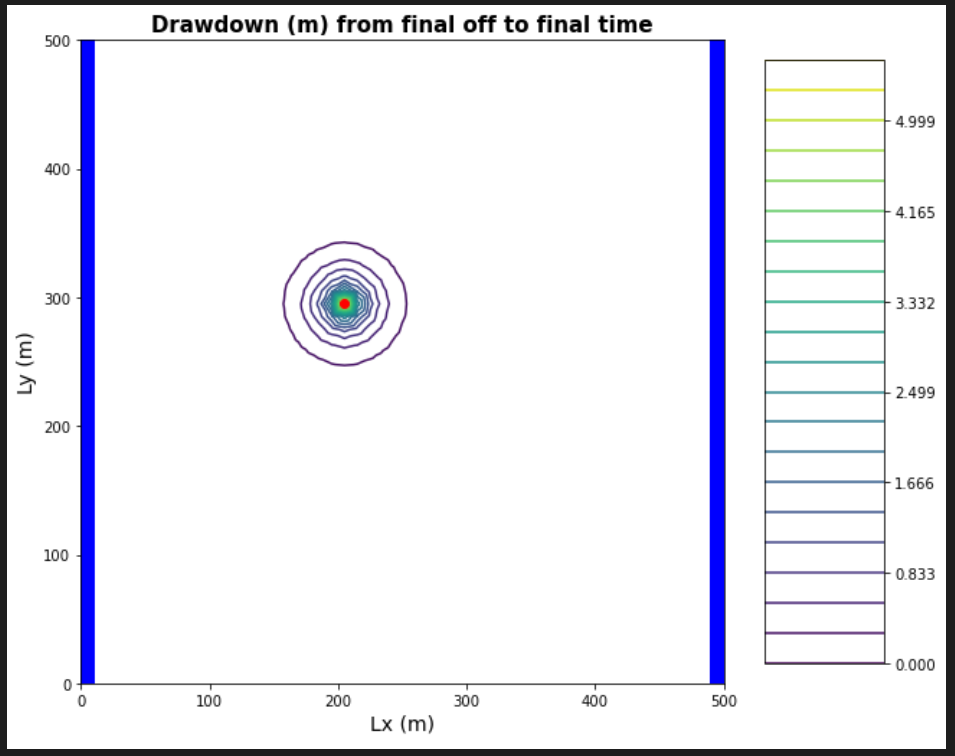

## Gillian Noonan
## HW 7 Challenge: Transients

## **Challenge:**
A flopy code is provided that simulates flow in a single layer model.  There is a well in the domain and uniformly distributed recharge.  There is no ET.  The aquifer is unconfined.  Use this to explore the response of an aquifer to time-varying pumping.    

### Model Description
Initial conditions:
 - homogeneous medium.  
 - single-layer domain, 50x50 cells
 - cells are 10 m in lateral extent and 50 m in vertical
 - well located at [0,20,20] (layer, row, column)
 - recharge at 5e-4 m/day
 - left and right boundaries have constant heads of 50 and 30, respectively
 - well is pumped cyclically: water is withdrawn at 500 m3/day for 90 days and then it is turned off for 270 days.  (Pretend that a year is 360 days long.)  The simulation is set to run for 100 years.  

### The Process
- First need to check through the "messed with" code and make sure to adjust all of the variable to match what they should be.
- Errors to note:
  - Per Slack - use Challenge versus what is in header of
  - Per Slack - use K value of 1
- Things I changed:
  - 3.2 - sim_years = 20 to sim_years = 100
  - 4.2 - H_init[:, :, :] = 50 to H_init[:, :, 0] = 50
  - 4.2 - H_init[:, :, 0] = 10 to H_init[:, :, -1] = 30
  - 8.1 - Q2 = 500 to Q2 = -500
  - 9.1 - recharge = 1e-5 #m/day to recharge = 5e-4 #m/day
  - 9.1 - rech_zone[10:20,10:20] to #commented out since recharge all over.
  - 11 - Plot head distributions - changed code to the following based on Dave's directions:
  
  

### Key Figures

Fig a) left panel showing the head at the well and right panel showing the head at the midpint of the domain, both as functions of time over the entire simulation.

Fig b)  The head along a transect between the constant head boundaries through the well at three times: the initial steady state; the final pump-on period; and the final pump-off period.

Fig c) A contour map with flow vectors at three times: the initial steady state; the final pump-on period; and the final pump-off period.

Fig d) A contour map of the drawdown calculated for two periods: between the initial steady state and the final  simulation time and between the final pump-on period and the final pump-off period.

### Noonan - Lecture Notes

If you want to understand the qualities of something you have to see it change.  Some parameters only matter when the system is changing - to understand them, you have to test the model when they're changing to be able to understand variance.  Boundary conditions control all systems.

Darcy's equation:
Q = -KA dh/dl
Take a parameter K, and relate an energy gradient to a mass flux (flow).  Can impose a mass balance and use that to describe an energy distribution given a distribution of the relevant parameter.   

Flow equation:  Divergence of the flux = change in storage with time (d/dx (q) = dVwater/dt)
example: box within finite element domain, with fluxes coming in, the divergance of the flux would be the overall change in flux with respect to the boundaries of the domain, so would be equal to: sum total of mass in minus sum total of mass out.  If this is equal to zero, then based on the flow equation, the change in storage with time would also have to be zero.  This is steady-state.  

For a well, the capture zone is smaller at early time than at late time.   At early time, the well is pulling water out of storage (by compressing sore pace and depressurization of the water), but with steady pumping over time, this will reach steady-state.   The flow vectors will initially be horizontal, when the well starts pumping they will start point to the well, and continue outward over time reflecting the size of the capture zone. All areas that have seen change in flow vector defines the zone of influence (where drawdown occurs), which in itself is transient.   Only becomes steady-state when only water providing to well comes from across boundaries so no more change in drawdown with time.

When considering capture zone, need to consider time to reach the well (so this will be smaller than the zone of influence initially).   Transient capture zone is difficult to calculate.  Can use a numerical tracer test to help figure this out - particle tracking!  Can add a bunch of labeled particles in different places at time zero surrounding the well, then can connect up or outline all particles that made it to the well at a given time after pumping starts - and that will give you the time capture zone of that well.    
Surround the well with particles and run time backwards - backward particle tracking, wha???  So you would need flow vectors for this then?  If you had flow vectors, why would you need particle tracking at all?

The challenge:
model 100 years worth of Response
at well and at center of domain, what does head look like
what does steady state mean, does it always mean constant in time?  or what is cyclical steady-state?
if could represent this as steady pumping through the year, how could i find that pumping rate?

-------------------------------------

### Noonan - Challenge Response

***a) The gradient is not uniform for the initial steady state conditions - discuss the influences of recharge and the unconfined condition on this nonlinearity***
> Initial Thoughts: The recharge will add water to the system that is in excess to what is coming in from the left boundary.   this will need to be accounted for to maintain Q in = Q out.  The constant head boundaries are fixed and cannot change, so the model must account for this.

> Lecture additions: For unconfined, modflow changes the saturated thickness of the aquifer - so the head gradient changes to make up for the reduced saturated thickness.  Head is not linear due to the addition of recharge adding volume to the system (mounded, curved).

***b) Determine if the system has reached steady state - consider a point at the well and another at the center of the domain.***
> Initial Thoughts:  Given plot (a) which shows head over time at both the well and the midpoint, the curves level out to a constant head over time somewhere around 50 years (eyeballing it) - these values are not the same head values for each of these points at steady-state, but what matters is that they are the same in time from point to point after that time?  Side question: Why are the shapes of these two plots so different?  Is it because the head values are fluctuating to a much higher degree right by the well, versus farther away from the well and we are seeing the highs and the lows??  If this is the case, I see what you are talking about with "cyclical steady state" I think!

> Lecture additions:  I like Quinn's method of taking a moving average if you needed a more accurate value than just "eyeballing it".  One step beyond that you could look at difference in change in average head over time and see when it approaches zero.  

***c) Find the zone of influence of the well defined in two ways:
    - Based on the drawdown from the initial steady state to the end of simulation time (end of final no-pumping stress period).
    - Based on the drawdown from the end of the last pump-on stress period to the end of simulation time.***  
> Initial Thoughts: Figure (d) shows drawdown calculated for two periods: between the initial steady state and the final simulation time and between the final pump-on period and the final pump-off period.  For the first case, the zone of influence would be found by looking at the drawdown contours simply (since it has reached steady state, the drawdown will extend past the boundary of the model and the zone of influence will equal the capture zone).   For the second case, the drawdown may not actually equal the capture zone because you will be in a period where there is no pumping so the drawdown zone of influence will be decreasing/shrinking while the zone of influence recovers.

> Lecture additions: First case shows long term change in head, second case shows short term change in head, which contributes over time cyclically to long-term change in system.  New term alert - Analytic element modeling: if can define boundary, then inside can have unique properties and can build complicated system and solve semi-analytically (solve so there is mass continuity across boundary of the elements)

***d) How long does it take a point at the center of the domain to reach steady state.  At that point, explain how you could divide the domain into a steady and transient part and solve each separately.***
> Initial Thoughts: From question b I said it would be around 50 years.   At the time that the center of the domain reaches this steady state, since it is the midpoint.
HOWEVER, in the lecture you said for this question that we would actually change the duration of the model to decide how long it takes to reach steady state at the center of the domain.  You said to look back at question b and see that steady state behavior at middle of the domain is not the same kind of steady state behavior in the well - some portion is still transient while rest of domain has reached steady-state. So i think the answer here is that the midpoint should be outside of the zone of influence at some point in which the influence would be 0 (zero change induced by well), and the well would be in a transient zone still (pumping in inducing drawdown which is causing change/transience).  So the general answer would be that it takes as long for a point at the center of domain to reach steady state as it takes the drawdown zone of influence to leave that point!  But, to quantify that, I guess would need to run models and look at the change in drawdown and what point in time that happens?

> Afterthoughts:  I think same general idea is good as above.   When the well is cycling, there will be portions of the system that are transisent (zone of influence nearest well), and portions that are steady state (farther from well's influence).  

***e) Find a constant pumping rate (same throughout the year) that matches the head time series at the middle of the domain.***
>Initial Thoughts: Do matching to see if can find constant pumping rate to match transient system.....how??  trial and error?

> Lecture additions:  I now see from Dave's example in lecture that he tried different constant pumping (year round) rates and plotted those along with the 500 m/d every 90 days rate and adjusted until he found a good match.  I think that since this is specifying a point in the middle of the domain, that this first condition would be OUTSIDE the transient zone is the key point here and that would expect this value to perhaps be different from the case of matching head time series for a point at the well.  But basic process is same: Would want to trial and error and minimize RMSE between trial and what you are trying to match.

***f) Find a constant pumping rate (same throughout the year) that matches the head time series at the well, leaving only a regular, repeating seasonal residual.  Are the two pumping rates the same?***
>Initial Thoughts: .....how??  trial and error?

> Lecture additions:  So then for this one, you would be looking to find a pumping rate that would match the cyclical transient nature of this area near the well.  The main reason for wanting to do this exercise is: You can fit a steady state equivalent to a cyclical system - could be more convenient to run one stress period with one constant pumping rate, so to be able to find rate that fits this trend is very useful to be able to do.   You may find that it is different inside and outside the circle (transient zone of influence) - largely depends on whether it is a reversible or non-reversible process (whether recovers or not - water into storage versus water out of storage - is that linear).  Unconfined system is not linear in dewatering.  

***g) Discuss the sources of water captured by this well.  If you're up for a challenge, calculate them for the final pump-on period!***

>Initial Thoughts: The sources of water captured by this well are initially water from storage around the well when it is turned on (done so by compression of pores and depressurization of water), at later times it would be represented loosely by the drawdown zone of influence, but not actually since you would need to consider the time it takes for the water to arrive at the well and be captured (can identify this using particle tracking).  And at steady state, it would be that the water is all coming from past the boundary and can be defined by drawing the classic capture zone based on flow vectors like we have in past assignments and find the flow/area.
Specific sources are:
- Available water sources: initial storage + flow in from boundary + recharge - ET

> Lecture additions: Still like my answer above.  Note from lecture: Capture zone will extend through time to reach the steady-state capture zone.   In the transient period (small circle around well), a particle may oscillate in that zone with the on-off of the well, but outside that zone, it will only know steady-state conditions.

***h) Discuss how you would define the capture zone of the well.  How is it different than our definitions of capture zone so far in the course?***  
>Initial Thoughts:  I think I started to answer this in the question above....  It is different than our definitions of capture zone so far, because now we are considering transient capture zone, where the capture zone does not always equal the zone of influence, and is not always steady-state like we have previously discussed.  Now we need to consider not only the zone of influence, but the time it takes for the water to reach the well (i.e. the zone of influence is greater than the actual capture zone for the transient case).

> Lecture additions: New concept from lecture is the idea that the capture zone remains the same overall, but within the transient period, the particle nearing the well will experience different conditions during the on-off of the well (even could go in and out).
--------------------------------------

***End of lecture suggestion: Look back at lecture when talking about finite difference solutions and see where the change in storage comes in and how that solution is accounting for changes in storage with time.***
>- I have not done this yet
