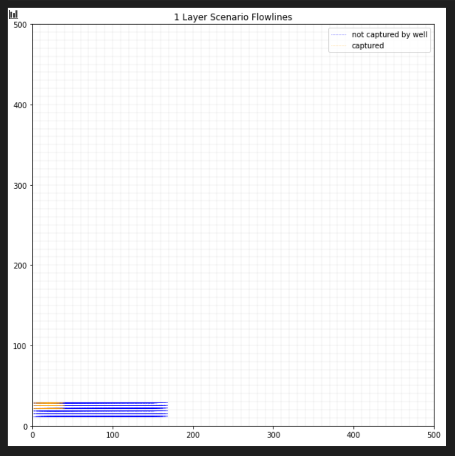

## Gillian Noonan
## HW 8 Challenge: Layers and particles

## **Challenge:**
No flopy code was initially provided, but Matt Ford acquired code from last year's class and provided this to the class as a sort of starter code.    

### Model and Challenge Description
​Add particles to last week’s model.  Run your equivalent steady state model (annualized pumping rate) model.  Use particles to track the time capture zone for the well after 25, 50, 75, 100 years of pumping.  Bonus, see if you can use color to show captured particles!

Then, break last week’s model into three horizontal layers:
- Top 20 m unconfined sand
- Middle 10 m confined silt
- Remaining unconfined sand

The pump only extracts water from the bottom layer and recharge occurs in the uppermost undrained layer.  Repeat your particle tracking for capture zone analyses for the layered model.  

> Last Week's Model:

      Initial conditions:
       - homogeneous medium.  
       - single-layer domain, 50x50 cells
       - cells are 10 m in lateral extent and 50 m in vertical
       - well located at [0,20,20] (layer, row, column)
       - recharge at 5e-4 m/day
       - left and right boundaries have constant heads of 50 and 30, respectively
       - well is pumped cyclically: water is withdrawn at 500 m3/day for 90 days and then it is turned off for 270 days.  (Pretend that a year is 360 days long.)  The simulation is set to run for 100 years.  

### The Process
1) First acquired code from Matt, which needed to be modified to run on my computer doing the following: I downloaded modpath from this link:  https://www.usgs.gov/software/modpath-a-particle-tracking-model-modflow,  then unzipped and pasted the .exe files from the 'bin' folder into same folder where I house the mf2005.exe file, then changed the line where Matt references "mp7" to "mpath7.exe" (Section 5).   Code then runs successfully.

2) Next.......I tried modifying last week's "Transient" code per the challenge instructions to add particle tracking (in submissions folder if you want to see where i left it).  I took pieces of Matt/last class' code and pasted into the "Transient" code and modified.   

> Modpath 7 had a normal termination with this message:

         Particle Summary:
         0 particles are pending release.       
         810 particles remain active.
         0 particles terminated at boundary faces.
         0 particles terminated at weak sink cells.
         0 particles terminated at weak source cells.
         0 particles terminated at strong source/sink cells.
         0 particles terminated in cells with a specified zone number.
         0 particles were stranded in inactive or dry cells.
         0 particles were unreleased.
         0 particles have an unknown status.
         Normal termination.                                                        

> BUT, am getting error on the particle output section: ValueError: could not convert string to float: '0.60134693-153', and could not figure out how to get past this.

### Key Figures
Incorrect Figure A)

Fig a) Time capture zone for four times and an infinite capture zone without layers.  You can combine these into one figure or show a separate figure for each time.

Fig b) Time capture zone for four times and an infinite capture zone with layers.  You can combine these into one figure or show a separate figure for each time.

### Noonan - Lecture Notes

-------------------------------------

### Noonan - Challenge Response

***a) How does the capture zone evolve in time?  Where does the early time capture zone get its water?***
> Initial Thoughts:

***b) Where does the 'infinite time' capture zone get its water?***
> Initial Thoughts:  

***c) How does the extent of the capture zone change when layers are considered?  Can you still define a 2D capture zone??***  
> Initial Thoughts:

***d) How does the extent of the 'infinite time' capture zone change when layers are added?  Explain any difference in the lateral extent of the capture zone along the left boundary.***
> Initial Thoughts:
