## Gillian Noonan
## HW 9 Challenge: Streams

## **Challenge:**
A flopy code is provided to you that simulates flow in a single layer model including a stream that runs along the center column.  There is uniformly distributed recharge over part of the domain.  There is no ET.  The aquifer is unconfined.  You will use this to explore stream-aquifer exchange.   

### Model Description
Initial conditions:
- ​homogeneous medium.  
- streambed conductivity changes within three zones along the stream
- single-layer domain is 51x51 cells.  The cells are 10 m in lateral and vertical extent.
- Recharge occurs at a rate of 5e-5 m/day in the first 26 rows.  
- The left and right boundaries have defined heads to represent a lake and a river, respectively.

You need to:
- Using initial figures, describe the nature (direction/magnitude) of stream/aquifer exchange along the stream.  In particular, explain why the leakage changes magnitude or direction where these values change.
- Use the head distribution to describe the movement of water across the boundaries and into/out of the stream.   
- Choose two things to explore (e.g. impact of streambed K or inflow into the river or recharge rate).  Produce a plot for each to compare to the base plots and use the plots to explain the impact of the hydrologic change.

### Noonan - Lecture Notes
>> 3/25: Interaction of Surface Water and Groundwater (gw)
- Boundary condition settings:
  - example: stream flowing in alpine valley through hard rock.
  - Type II (no flow) at bottom and sides.  remember that MODFLOW defaults to no flow if not indicated.
  - For 2D representation, ignore flow into the page.
  - Defined head applied (Type I), representing stage (height) of river - datum is at the bottom so this is a constant value across the bottom of riverbed.
  - Top above the stream depends on conceptualization (eg Type II: rain would be flux equal to recharge at gw, or could apply ET and infiltration at ground surface).   Basically just need to figure out where does water enter our domain - that's where to define our boundary, then anything that happens inside the boundary we have to take that water out across that boundary.
  - Potential for seepage face where gw meets slope.
  - In plan view, can model by knowing head as a function of distance along the stream.  Can use this to model impact of stream on groundwater system.  So for each cell in domain that contains river, can tell model what the head is in the river at midpoint of cells, then calculate head value in subsurface. If know K, can determine flow into and out of stream.  The domain is the top of the river bed and the stage in the river (with respect to datum!) is just a boundary condition we are applying to the groundwater model.
  - river package does not transport water, but stream package does.

>> 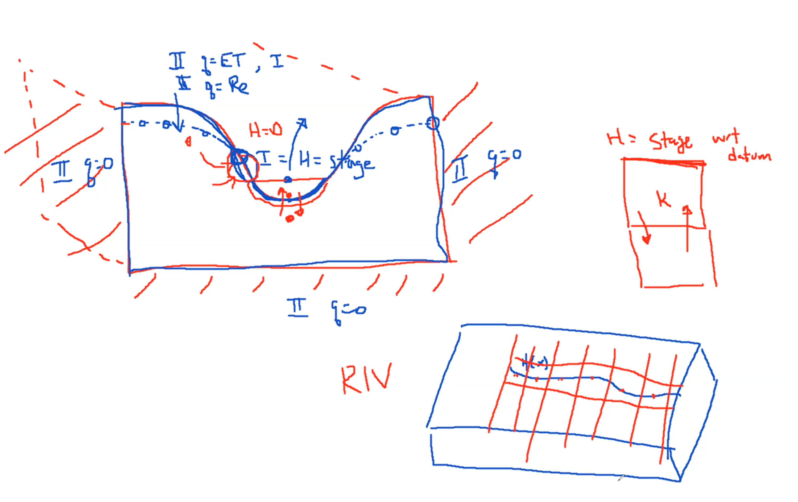

>> Stream package (STR) [this is the one we are working with]
 - https://water.usgs.gov/nrp/gwsoftware/modflow2000/MFDOC/index.html?str.htm
 - considers reaches in sequence: first reach gets some flow in, then can either calculate stage to emit flow or define the head values (stages).  Then considers how much goes out, and that determines flow to next cell, and so on.
 - how does it deal with tributaries? - breaks into segments and reaches, and keep tracks of who inputs to who.
 - height of streambed also matters
 - within each reach define elevation of streambed, width of streambed, and roughness.
 - STR routes water in the surface, but in a prescribed way.
 - does not allow you to account for ET from stream itself.
 - does not account for reverse flow (ex. tidal marsh, or flooding that reverses flow in another reach)

>>Streamflow routing package (SFR)
- calculates direction of flow in the stream so can handle things like tidal effects.
- moves the upgradient node to center, which allows calculation of ET as well.
- lets you define topography of bottom so can account for increased infiltration as river/stream gets wider.

### The Process and Key Figures

Initial Figures were provided.  Process was to run the code and answer questions on key figures, then change some things and see what effect they have on the model output.

FIG 1. Initial boundary conditions

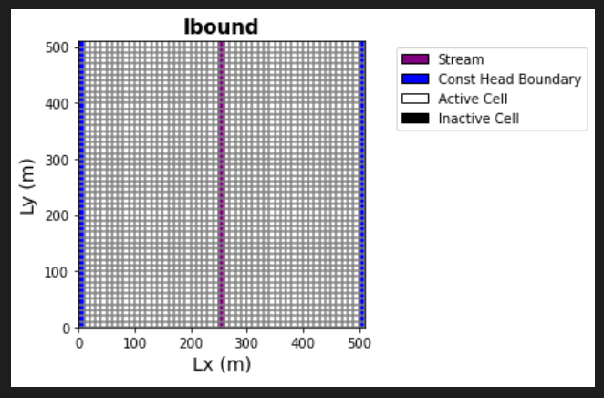

FIG 2. Initial Flow versus Row# and Head versus row#

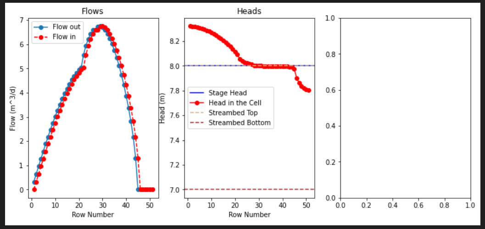

FIG 3. Initial Head distribution (plan view)

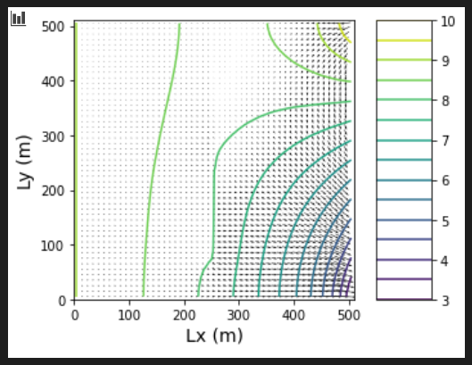

-------------------------------------

### Noonan - Challenge Response

***a) Using initial figures, describe the nature (direction/magnitude) of stream/aquifer exchange along the stream.  In particular, explain why the leakage changes magnitude or direction where these values change.***
- Answer:  First, to make sure I understand this conceptually: Left boundary is constant head lake, right boundary is defined head river (runs down the domain).  Single stream reach is centered in the middle running from top to bottom of the plan view, sitting in homogeneous materials with K of 1 m/day in x,y,and z.

- From the top of the code:
  - Stream Properties:
  - Inflow to first reach = 0 m3/d
  - Streambed slope = 0.0001 m/m
  - Streambed rough = 0.02377
  - Streambed width = 20 m
  - Streambed K = 0.01 m/day for the rows 0-19, 0.1 for rows 20-25, and 1 for the rest of the stream.
  - Streambed thickness = 1 m
  - Stream bottom depth = 7 m

From the starter code:
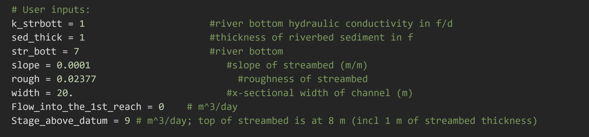    

- So the first thing that strikes me is that inflow to the first reach is 0 m3/d.  So where does the water in the stream come from?  Looking at the plan view plot of head distribution, we know that water flows from high energy (head) to low energy.   In this case, there is high to low gradient (subtle, small flow vectors) happening from the left boundary where the lake is, but then also a less linear gradient of high to low towards the stream coming from the upper right corner of the model space where the river is present.  So, the source of water appears to be from both the river in upper right quadrant, and less so the lake to the left.  As well, starter code has a recharge zone located at rech_zone[0:26,:], or first 26 rows, at 5e-5 m/day, thought I'm not seeing this as a big effect to the plan view head distribution plot - as in, there isn't an increase in flow vectors when compared to lower rows due to this recharge from what I can tell.    

- Looking at the flow vs. row number plot, one can see that flow starts at 0 at top of reach, and then increases at a particular rate up until after row 20, at which point a change in flow rate can be observed (increasing flow/row).   This reflects the change in streambed K from 0.01 to 0.1, where higher conductivity lends to higher flow.  Then, after row 26, the k increases once again, BUT, the flow decreases.   This indicates that the stream is now losing water.  But why, and where to?  The head distribution plot shows a significant decrease in head towards the lower right hand corner near the bottom river edge of the model.   So I would propose that the stream is being drained into the river in that direction due to the decreased head gradient in that area moving water from higher to lower energy state.  I think this could be due to higher stage in the stream, or higher elevation in the stream?

***2) Use the head distribution to describe the movement of water across the boundaries and into/out of the stream.***
- Answer:  I think I answered this one above a bit, but building and looking at the head versus row number plot, the head initially is ABOVE the stream stage up until past row 20, after which it goes to equal the stream stage.   Towards the highest end of the row number, the head dips below the stage head.   

- When the head in the cell is above the stream stage, the stream is gaining water (water in); when the head in the cell is equal to the stage head, the stream is maintaining constant water level; when the head in the cell is below the stage head, the stream is losing water.  The plan view head distribution plot also supports this, with higher head to the left and upper right, and decreasing head to the lower right corner.

***3) Choose two things to explore (e.g. impact of streambed K or inflow into the river or recharge rate).  Produce a plot for each to compare to the base plots and use the plots to explain the impact of the hydrologic change***  

1) First I explored the effect of changing the streambed K to be low conductivity (K=0.01) throughout - I might expect this to result in less "leakage" of the water since there would be less infiltration?  And also to smooth out the flow over the rows to be more constant of course since now there is no fluctuating K segments.     

So I changed this:

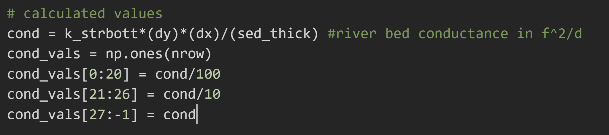

to this:

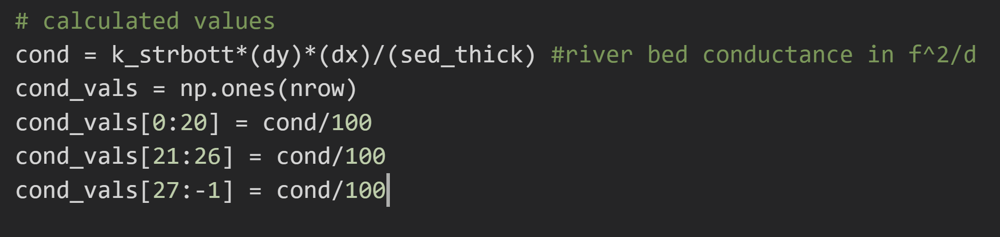

What happened?

- The flow across the rows becomes much more balanced (as expected), and the head by row number transitions smoothly from above stage head to below stage head in a symmetrical shift right at the stream, with flow increase to rows 0-25, and flow decrease for rows 26-51.  The plan view head distribution really does not change all that much - I think this shows the strength of the effect of the right hand boundary on the stream.  

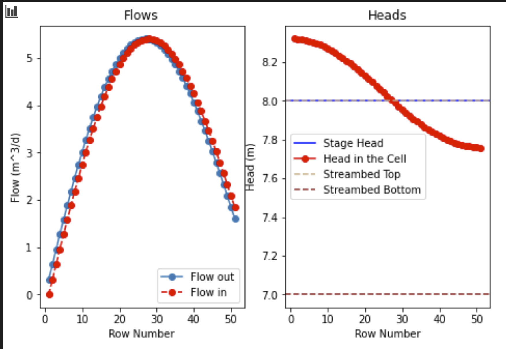

head distribution (BEFORE)

head distribution (AFTER)

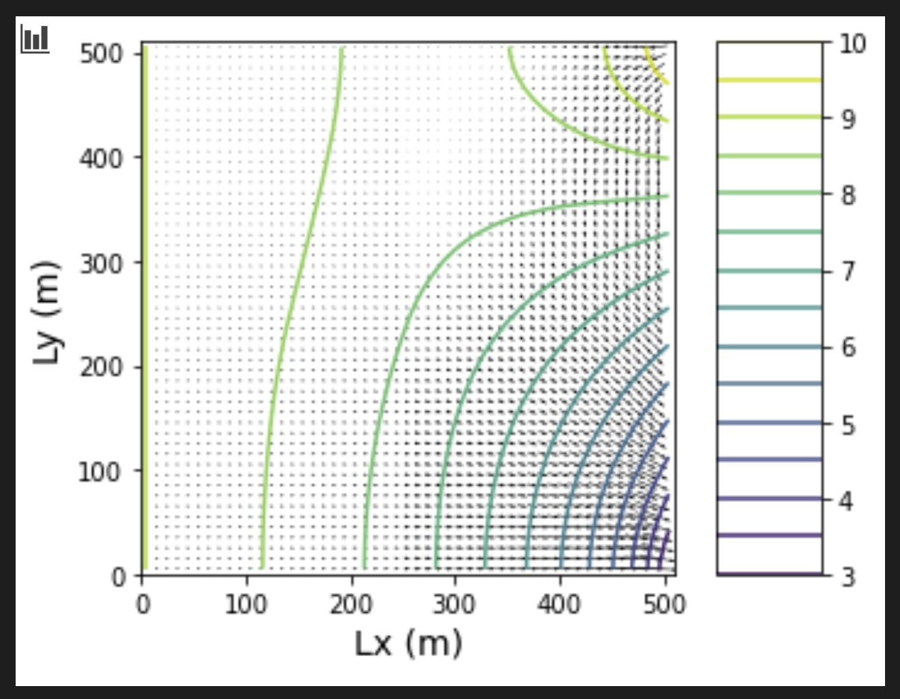

1b) Then I wanted to explore the effect of changing the streambed K to be HIGH conductivity (K=1) throughout.  However, this isn't really high conductivity since the surrounding material is also all K of 1, so it's more like someone dug a ditch and filled it with water perhaps - no sediment.

What happened?

- Most noticeably, the head in the cell now tracks right near the streambed top (stage head) for most of the reach in the Head vs. Row Number plot, with some loss still towards the end when it nears the river sink feature. The head distribution in plan view shows a bit more of a steady (linear) head equipotential line running parallel to the stream now.   

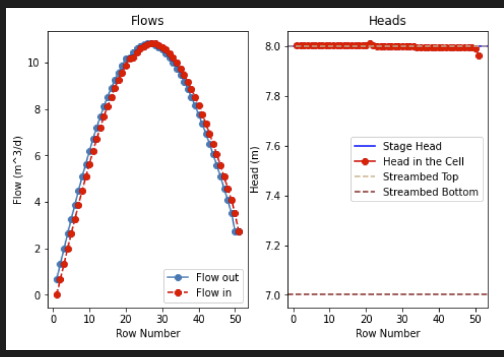

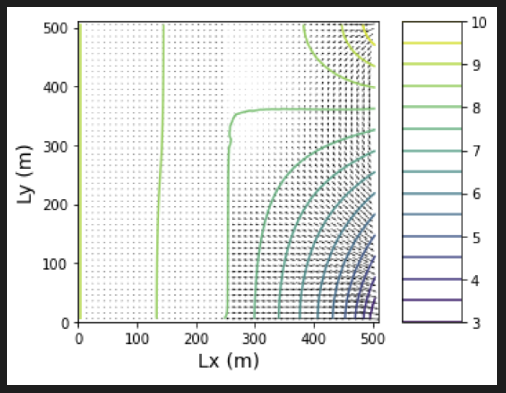

2) Second I decided to reset the streambed K values to starting, and then change the streambed width to double (from 20 to 40m) - I would expect this to maybe reduce the flow since it is now distributed across a wider reach?  

What happened?

- Looks like from the before and after plots that a whole lot of nothing happened!  And no matter how high I bumped up that width, it still gave me same plots.   I guess that isn't really a factor accounted for in this code?  I wonder if the Streamflow Routing (SFR) package would show something!

BEFORE:

AFTER:

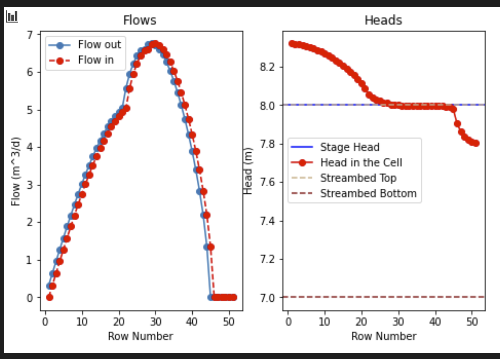

BEFORE:

AFTER:

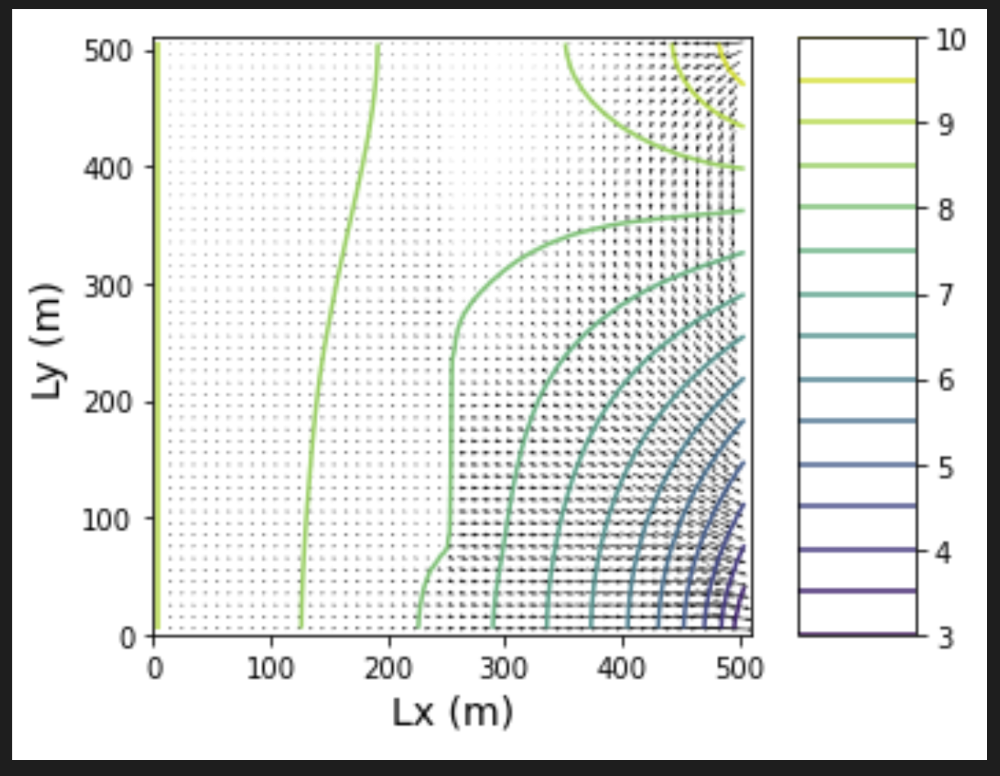

--------------------------------------
