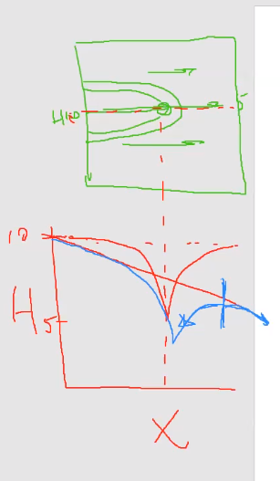

## Gillian Noonan - Midterm Response

### What is a model?

 A model is a representation of something that we want to know more about and we have a specific reason to want to know more about it.  So we take the information that we do have, or that we assume, and we put it all together to gain greater understanding of some larger process or environment. Can be used to forecast what we think might happen.  

 In general terms, a model is used to investigate aspects of a system and furthermore, the affect on the whole by changing singular conditions or properties.  It can be considered as putting all the pieces together to see how one piece affects the other things.  Conceptually we can put these pieces together, but as we start to put them together and make calculations, we can start to see things that are hard to see at a conceptual level.

### What is a conceptual model?

 When you have a problem or system in question, the first step is to sit down and sketch out/outline pieces of the puzzle.  This could literally be a drawing of your model with known or assumed properties and features (ex. structure, properties).  Outlines what steps and information you will need to consider to get from "here" to "there" with your model.

 An important part of this process is figuring out what you can ignore or leave out.  How would you determine this?  Consider from your list of properties and processes, what most matters to my outcome, what will affect (or not affect) the system I'm interested in modeling?

 There are different levels of being able to leave things out - You can start with very basic level of knowledge to determine what is important and what is not (example: color), then can go further using more quantitative knowledge to think about the processes and properties and how they affect outcomes, but then can take even further and consider more detailed things like layers or small variations in hydraulic conductivity or season variations in water level.  

### Sensitivity analysis

 In order to determine whether or not the presence or absence of something, or variation of something, has an effect on your model - do a sensitivity analysis.  You can use models to determine whether or not you need to build a model - sensitivity analysis.

 ### Parameters

Parameters are not just simply putting a value in a grid cell within your model.  For a mentally demonstrative example, consider parameters as kids in a play - all of the kids need to get dressed for the play so they are all grabbing costumes out of boxes - But - your model grid is NOT the boxes in which we are putting the parameter values.  We have the grid (spatial discretization), and then we have a whole other space, which is parameter space.  Parameter space is like the difference between the costume boxes and the kids.  For example, you can lump together understanding about what is the hydraulic conductivity of a sand, and then in this space you can say, does this grid have sand in it?  If yes, you can go and pull out that parameter value for sand.  

Or, can think of it as, what are the range of values of things that matter, that's the parameter space.  And then that other space we're going to map those parameters on to is the physical space.  In that sense, if you had a separate box for every pair of shoes, it gets to be a little bit useless - you might as well just throw them all in a pile.  It's when you can start to bring it all together and say "this is what we know about shoes", and if you want to know something about shoes, this is the place to go look.

Parameters contain a lot of information about a system and you should gather only what is needed.  For example, there's a certain amount of information that's relevant to the way that water moves.  So if I need to know how the water moves I'm going to gather just that information.  But, if I'm interested in how salt moves, I need to gather different information.  Parameterizing a model is taking all of the information and putting in the smallest number of boxes while still remaining useful.

### Dimensionality of parameter space

Orthogonality of parameters means they are independent of each other.  We don't want to have to know anything about one parameter to be able to define another one. For example, if we have a hydraulic conductivity (K) value for sand and a K value for a clay, and we increase the sand K and decrease the clay K and we can still match data equally well - then these parameters are not independent of each other.  So we  don't have a way to know either one of them, we can only know their relationship to each other.  This concept becomes really important when trying to figure out whether or not a model is well constrained by the data.

Axes are an illustration of orthogonality but it is not complete - It's an illustration of the idea but it's hard to conceptualize beyond the 3-dimensions, say into the 1000th dimensional space.  

# hydrological questions:

### Flow paths and capture zones
Some basics:
- Flow systems are a balance of forces.
- Flow will move from high to low gradient.
- Flow will go parallel to a no flow boundary (can't cross so must go along).  A no flow boundary will place a constraint on the system.
- When symmetric, flow will be same on each side of bisecting flow line.

In the case above, you have flow that's being pushed left to right by the gradient.  But you also have some force that's being applied by the no flow boundary that's putting constraints on the system.  

### Capture zone of well -

Capture zone can be drawn from flow vectors, which are given by equipotentials.  HOWEVER, you can draw the capture zone of a well without equipotentials using some reasoning and estimation, because sometimes it's hard to know what the equipotentials are going to look like.  Sometimes it's easier to just wing it - for example, we know flow will be from high head to low head so we know direction of flow.   And then we know there will be a general bending of flow lines to and around wells.

### Linearity of systems
In linear systems you can walk through a solution directly - you don't have to iterate back through.  An advantage of a linear system is it is more easily solved.   You can take advantage of linearity in the systems since you can add two solutions because one does not affect the other one.    Example is image wells, which can be used to understand the response of a well to a boundary.  Since there is symmetry and the wells are independent of each other, they can be added!  So if one is pumping, lowering of the head does not affect the other.  

### How pumping affects head-drawdown

Drawdown from a well will show a drop in head with a characteristic shape as shown below.   On the right side, the well is drawing less water from that side, but another note is that there is a location (shown by blue vertical line) where flow is zero.   This is a stagnation point with flow occurring to each side (to left and to right).   The zero point is associated with the capture zone as the outermost edge of the curve farthest to the right of the well.    

### Wise words in summary:

Being able to pull all of these things together, looking in cross section, thinking about superposition, or linearity, or symmetry to understand things, comes with experience and looking at a lot of flow results, BUT it only comes if you intentionally make and effort to do it.  So, whenever you're getting model results, really look at them critically and make sure you have a deep understanding of what's going on, and if you don't, take the time to figure it out.  Because each time you figure that out for yourself you're going to sharpen those skills and then with time and practice you'll start seeing it right away, but working at it purposefully is the only way to get there!
