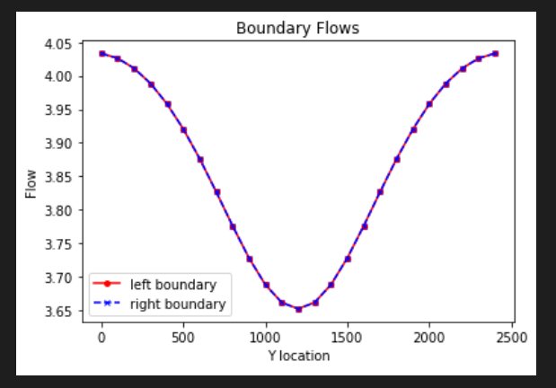

## Gillian Noonan
## HW 3 Challenge and Discussion Questions, Box Model- FloPy Exercise

## **Challenge:**
A flopy code is provided that recreates the 2D, heterogeneous model created manually in MODFLOW for the last exercise.  The code creates plots that show the grid, boundary conditions, 2D K distribution, steady state boundary fluxes, and steady state heads along a profile connecting the constant head boundaries.  It also includes a plan view map that shows both equipotentials and flow vectors.  

### Model Description
​The model provided is set up for a heterogeneous medium - a homogeneous medium with a centered, square low K inclusion.  

Dimensions:
- 25 by 25 by 1
- dx = dy = 100 m
- dz = 10 m

Subsurface Properties:
- Heterogeneous
- K = 1.0 m/day in x, y and z with a 5x5 inclusion with K = 0.1 m/day centered in the domain.
- Porosity = 0.35
- Specific yield = 0.3
- Storage coefficient=0.001

Boundary Conditions:
- Right boundary is constant head of 10 m relative to the datum, which is located at the bottom of the domain.
- Left boundary is a constant head of 20 m relative to the datum, which is located at the bottom of the domain.

### Noonan - Notes

 - Hint from Ty for #3: For a 1D column, you would calculate K by measuring the total steady state flow through the column (sum over the boundary) divided by the gradient (total head loss over the total length).  Take exactly the same approach for the entire domain to find Keq for the heterogeneous model!  For the relative/absolute question ... how would you compare the head distributions for two different cases - K_background = 1 and K_inclusion = 0.1  vs  K_background = 10 and K_inclusion = 1?  What would you learn if they were identical (within solver error)?  
 - Equivalent K represents a value that replaces a heterogeneous system with one overall value for k (i.e creates homogeneous representation where total flow through the system is same, boundary conditions remain the same).  For example, if you had a box with heterogeneities you could not see in, measure flow using boundary conditions - this K value will be same as if solved considering all heterogeneities.  "Equivalent homogeneous system, taken as a whole".

-----------------------------------
**The Process and the Key Figures:**

As far as process - This one was a struggle for me and I spent too much of my time trying to figure out how and across what range to get the flow values to complete the challenge plots.  I used a lot of my available time trying to figure this out.   As advised by Ty, in the future I will reach out to my classmates to see if anyone has tips on my sticking points when encountered.  It's a mutually beneficial scenario where they also learn through guiding.  It was also reassuring to hear in the breakout room that others were also stuck and found their way unstuck through help from fellow classmates who had already "gotten it".    

*Figure 1: Base case boundary fluxes.*

*Figure 2: Base case boundary fluxes and flux through midline of domain.*

*Figure 3: Comparing 2D Keq with the area-weighted harmonic mean K.*

*Figure 4: Comparing 2D Keq with the area-weighted arithmetic mean K.*

-------------------------------------

### Noonan - Challenge Response

***1) For the initial values of background and inclusion K, plot the flow into the left and out of the right boundary.  (The code, as provided, makes this plot for you.)  Explain why the values are not constant along the boundary (relate to the definition of a Type I boundary).  Explain why the flow distributions are the same for the left and right boundaries.***
> Answer: Figure 1 above shows this plot.  The values are not constant along the boundary because the inclusion is having an effect on the flow into the system (lower in the center of the system).   A constant head was set along this boundary/flow entry zone, and in order to strictly maintain that head, the flux must adapt over the boundary, which is why it shows a curve that is higher flow at the top and bottom (clear path across model zone), and lower flow at the middle (effect of the low k inclusion).

From lecture 1/28:
If we set a Type one boundary condition we get to tell it what the head value is, but the flux will adjust in order to establish that desired head. So in the case below, it has to shove less flow through the middle of the domain due to the low K inclusion zone, and more flow is going through the top and bottom zones.

***2) Add a plot of the left-to-right flow along a line that passes through the center of the inclusion.  What can you learn from comparing this distribution to that seen on the boundaries?***
> Answer: Figure 2 above shows this plot. You can learn about how the inclusion affects the flow through the system, and see the extent (distance) of how far from the inclusion this effect takes place.   It is clear that at the boundaries the flow is not hampered by the inclusion as much as when it is closer to (or within) the inclusion, but there is still an effect.   Interestingly, the flow increases as it approaches the inclusion and then drastically drops at the location of the inclusion (due to the abrupt lowering in hydraulic conductivity).  The increase in flow up to the inclusion is likely due to the increased velocity needed to go around the inclusion as the water is forced into smaller space with same volume of water to pass through.  

***3) Calculate the total flow into (and out of) the domain.  Use this to calculate the Keq of the heterogeneous system with the K values as given in the starter code.  Repeat this calculation for the following K values for the inclusion (keeping the background K as it is given):  0.01, 0.1, 1, 10, 100.  Compare the Keq to the harmonic and arithmetic mean K values based on the area occupied by each medium (rather than the length for a 1D system).  Can you draw any general conclusions about the impact of high or low K heterogeneities on the equivalent K for the flow system examined?***

> ***From lecture tip from Ty:***
"Figure out what is total flow - we have flow into each cell - add up flow into each cell.  We know gradient, we know flow for an assumed homogeneous system, then what would K have to be to give that same flow for those same boundary conditions."

> Answer:  General conclusion is that K varies depending on how you calculate it, and it is not an exact known number - So don't sweat it in your modeling.   Every sample is heterogeneous if you look at a small enough scale!

***4) Does the equipotential distribution depend on the absolute or relative K values for the background and the inclusion?  How would you use the model to test your answer?***
> Answer:  Yes, the equipotential values depend on the K values as seen in the plots produced for each model trial scenario with different K values.  The equipotential lines for flow are affected by the changing values of the K zone, from less than background (flow goes around), to greater than background (flow is funnelled into).  You would test your model doing exactly what we did here, which is modify the K values and observe the flow lines.  Another test would be to move the inclusion to other locations in your model space and observe how the flow lines are altered.

Equipotential Lines - K=0.01

Equipotential Lines - K=0.1

Equipotential Lines - K=1

Equipotential Lines - K=10

Equipotential Lines - K=100

--------------------------------------

### Discussion Points
**In addition to The Challenge, start thinking about the following ideas:**

What are the implications for your results for representing K in a model cell, given that the distribution of K is always heterogeneous at the small scale?
> Initial Thoughts:  The implication is that it will always be an estimation and that is likely good enough!

Discuss what it means to say that, for steady state flow, there are equivalent Type I and Type II boundary conditions.  How might this be useful in practice?
> Initial Thoughts:  Hmmm, equivalent Type 1 and Type 2?  Type 1 is Fixed or defined head, Type 2 is Gradient or the flux.  Maybe this means that you can find values for each that you would set in your model that would produce the same output results?

How could you (or did you) use looping to answer The Challenge more efficiently?
> Initial Thoughts:  You could use looping to test many different variables in a series.   Instead of changing 1 value and running the code to produce an output, and then repeating the process for each other variable, you could form a loop where it runs over the series of given values in a "loop", and then outputs each result into a table of results in one model run.

What are some advantages (easy) and disadvantages (harder) of using flopy rather than building MODFLOW models manually?
> Initial Thoughts: Advantages are that a lot of it is more automated than the manual build.   Disadvantage is (why we started with manual) that you may lose understanding of what the base pieces of MODFLOW are.   Another disadvantage is that python is a whole other language to learn.

What would you find if you altered your model to consider unconfined conditions??
> Initial Thoughts:  The flow paths would for sure change.  They would have more freedom to migrate into the directions of the unconfined zones- there would be less pressure directing them in a certain flow path/direction.
