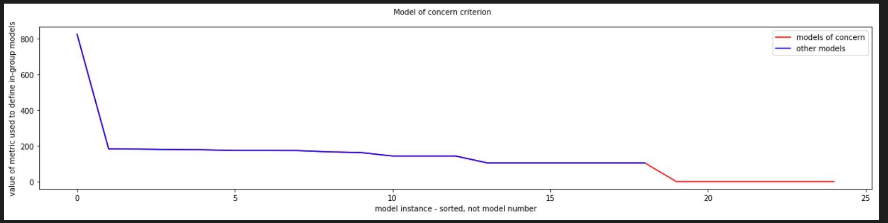

## Gillian Noonan
## HW 11 Challenge: Effects of Pumping

## **Challenge:**
Two code have been provided to you for the second half of the term.  Both are available in The Big Challenge directory.  The first runs and ensemble of models and gives you options to design the ensemble.  The second analyzes the results of the ensemble run.  An overview of the codes and the Challenges for the second half of the term are presented in this video: https://2018hwr528.weebly.com/run-ensemble-code.html.  You will want to set up a separate python environment to run these models because they rely on an older version of flopy (and modpath).  A very helpful document is included in the Big Challenge directory named hwr528_environments.docx!  You will also have to establish three subdirectories below where you place the run and analyze codes - one named output, another named current model output, and a third called likelihood.  You will need to have the mf2005.exe and mp6.exe codes in the root directory (where you placed the two codes).  The steps for running the code are:

### Model Description
Basic set scenario:
 - mountain catchment
 - no flow boundaries on three sides
 - downgradient boundary has been established as constant head based on the results of a larger-scale model
 - municipal well in the basin
 - Some of the water used by the town is recharged after treatment, some is returned to the stream that runs through the basin
 -  Recharge is associated with the mountain block.  
 - ET occurs in the basin floor and at a higher rate in the riparian area adjacent to the stream.  
 - An agricultural business has proposed to add a well and irrigate crops on a new field.  
 - The model is run as three steady state conditions: No Town and No Ag (NTNA); Yes Town and No Ag (YTNA); and Yes Town and Yes Ag (YTYA).  Some model parameters are known, others are unknown.

You need to:
- Use the model to determine the risks of the agricultural business in terms of agrochemicals reaching the stream, reduced streamflow, and additional drawdown in the town well.  
  - run 25 random models and look at results - problem or no?  
  - pull out key results and throw into word files
  - identify 2 MOC models
  - change model gentype that allows to perturb things in addname
  - will produce 10 new models, copy over to output and it will redo analysis with augmented ensemble set.

### Noonan - Lecture Notes
4/8: Monster Codes

General:
- 3 stakeholder groups (Ag, Town, Enviro) will be formed and will use model ensembles to guide decision making for common problem
- ensemble modeling vs. deterministic modeling.   Now we will look at multiple models (ensemble)
- Will ignore transients and just look at steady state of pumping of town and ag well

***run_ensemble***

MODEL SETUP
  - 50x50 rows/columns, cells are 1000 m on a side
  - horizontal layers, surface has topography
  - parameter values are set up to have 1 of 5 values for each
  - fixed parameters and fluxes won't be messed with?
  - have some moveable elements for return flow from town well, where the farm is, where the irrigation well is, where recharge basin for town is located.
  - pumping rate has factor that considers growth rate of Town
  - town well is pumping from lowest layer
  - farm has 3 options for kind of crop you can pick

ENSEMBLE DEFINITION
  - naming - m + a bunch of numbers - each number represents the value for one parameter (can use name to figure out base model settings)
  - defaultid gives default values for parameters
  - Bottom of this section is part of model we will be changing.  Has some flags.   -1 uses default settings.
  - tempid1-7: Not gonna mess with those for first part of analysis at least
  - tempid8-14: mess with these.   Can either default with -1, or can put a specific value (ex. 2), or can put multiple values (ex. 0,1,2)

REFORMULATE ENSEMBLE MATRIX
  - modelgentype - type used to generate models
    - type 0: randomly select parameter values, tell how many samples and how many of the 7 parameters you want to randomize.  
    - type 3: will use multiple values of the parameters and take all possible combinations of each of them.  Iterates through each combinations
    - type 2: takes base model and will just perturb one parameter at a time for all identified values.
    - type 1: more complicated, taking models from addname and perturbing them.  Pulling in parameter space near to other models you identified as "interesting".  Seed models with other models, Oversamples parameter space.  Helps to refine which area of parameter space is a good fit and gives direction for future modeling, or can be used to perturb one specific parameter to see its effects on one specific addname model.
    - type 0: just does the addname models specifically, runs again no perterbation of parameters but can move a changeable element, for example.
    - type -1: can be used to fix values that are not in the list, that are not choices.  Can be used to generate a truth model and use that model to generate data so that we can't get exactly the same model and blow up the code.
  - addname: adds specific models (ex. addname=['m001001334000240', 'm001001334000244', 'm001001334400240', 'm001001334400244']) - these 4 will be included in model ensemble
    - can also look at models that are similar, by taking one value parameter for addname model and produce models similar.

DIRECTORIES:
- Current Model Output:  model dump location for run_ensemble, will overwrite each time if not moved out and same name. (Before runs, select all and delete)
- Output - storage location for all models you want to analyze.  Everything in here will be analyzed in your model-ensemble. (Keep organized by deleting models, but need to keep truth_heads and truth_strflow in here)

***analyze_ensemble:***

Behavioral vs. Non-Behavioral model:
- A model that converges but it just still isn't realistic, that is non-behavioral model.  Can be a good fit to data, but still be non-behavioral.   Need to use judgement and common sense to assess results.
- code defines scenarios where the model will be deemed "non-behavioral".    

Model of Concern (MOC):
- Prediction can indicate model of concern based on scenarios defined in code.
- number of MOCs indicates the actual risk associated with a scenario
- need to weigh out risk based on # MOCs, how well they match the data and real system, and how much risk is represented by ensemble of models and the fractional status of MOC or OK.
- MOC can be a flag for increased sampling in that parameter space

Likelihood:
- Sorted model: 1 = highest likelihood.
- helps you to get rid of low likelihood models using a likelihood limit.
- = 1/(sqrt(observed - predicted)^2)
- inverse of mismatch
- largest mismatch = smaller likelihood
- all sum to 1

Feedback Produced:
- how many models, how many non-behavioral and which, which were low likelihood, average values for behavioral and non-behavioral models.  
- shows model of concerns and metric value threshold (seen by color transition)
- likelihood plot, colored by MOC or Non, including numerical likelihood value.

Plots: ML - maximum likelihood, Mean, Standard deviation
- head in top layer, drawdown, etc.
  - broken down into MOCs, etc.
  - lots of data views for analysis of MOC parameters
- particle capture:
  - yellow - likelihood is 1 for capture  
  - looks at ag well, river capture
- stream
  - colors represent different models
  - can view differences in before/after ag well
  - leakage, and where
  - and lots more stuff
- locations of obsv pts, wells, return flow
- summed likelihood of head values, broken down by MOCs and other models

Lecture 4/13: Parameter estimation, Uncertainty

Parameter estimation:
- look at mismatch
Uncertainty:
- look at variance
Ensemble Modeling:
- distribute models throughout parameter space, take mismatch or likelihood and color code.  Get set of equivalent (or equally good models).  Can give you likelihood vs. prediction (sum of likelihoods (area under curve) is equal to 1),  

Decision Support Ensemble Modeling:
- incorporates significance of importance to stakeholder
- can help you to focus areas for additional modeling or refinement of analysis based on spatial distribution in parameter space

Latin hypercube sampling
- can help with random sampling to not have all models end up in a bunch in one area (unlikely, but possible).

modelgentype=2

- generates random samples and random variables
- randomly spread out through parameter space

Pick MOCs and add to addname.

modelgentype=1

- goes through all models in your list and perturbs parameter

Streamflow plots:  
0 in mountains and 50 at end, return flow is where the jump is.

### The Process and Key Figures

Key Figure examples were provided.  See file "key figures - Ty's version.pdf"

***The Process***

1) Get the run_ensemble code running.
- done, with some initial minor error troubleshooting

2) Empty the current model output directory.

- ok

3) Delete all of the m#### files from the output directory.

- ok

4) Run run_ensemble.

- ok .  run_ensemble runs with no errors.

5) Move the files from current output to output.

- ok

6) Run run_ensemble and extract the results that you want.

- should this say "analyze_ensemble"?   I get an error in the GENERATE REPORTS section:

Looking for b_meanid i see this section which contains an "if" statement relying on nonbehavioral_ids.   Theory is that if you have no models with non-behavioral tendencies then this error will present.    When i went back to run_ensemble and made the modelgentype = 0 (random) and re-ran, the error went away with a new model set that had 4 non-behavioral models.

re-ran with random generation and no errors in either code:

7) Copy the m### files to a 'hold' directory in case you want that model set later.

- ok

8) Set up run_ensemble to add models to your ensemble.

- ok, this is where we use the different setting options for addname, yes?

9) Repeat steps 2-8 to augment your ensemble.
-------------------------------------

### Noonan - Challenge Response

***1) Describe the scenario being modeled based on the fixed parameter values and the base model parameter values.  WHo is the stakeholder? What is their definition of an MOC?  What are the selected 'design' options of the ag facility and the town (return flow fraction, location, field location, etc)?  Essentially, paint a picture of what is being represented by the model.***

- Answer: The base model as set up has the stakeholder set to "env".   This is a flag located in the User-
defined Settings section of the analyze code.     

Here is the section of code for MOC of env in the analyze code.  I don't understand what it is doing.

***2) Construct an ensemble with 25 unique parameter sets chosen at random and generate output in current model output.***

 Done.  changed modelgentype to 0 to run random set of 25 models.

***3)  Remove all of the m### models from output and move all of the models from current model output to output.***  

Done

***4) Run analyze_ensemble and construct your version of the Key Figures - Ensemble 1.***

There were 4 non-behavioral models in the initial ensemble;  each of the three metric for behavioral models was exceeded (red lines above).   ***why aren't the metrics labeled? this part is confusing to me.***

There were 5 models of concern - highest likelihood MOC was m001001330024114 and m001001330211204, each with likelihood of 0.11.

***5) Use the results to identify one MOC and use that to generate 10 additional similar models.***

I am going to choose one of the top likelihood models:  m001001330024114.

To generate 10 additional similar models, i changed the modelgentype to equal 1 (perturbation of specific user-defined run(s) listed in addname) and re-ran.  

***6) Move the m### model results from current model output to output.***

done.  It told me there were 19 files with the same names in there already so I just wrote over them.   Should it do that or did i do something wrong?

***7) Rerun analyze_ensemble and construct your version of the Key Figures - Ensemble 2.***

More of the models are showing higher streamflow now, other than that i don't see any "jump out at me" big changes in the analysis plots with the new ensemble.

### Noonan - Challenge questions

***1) Based on your initial random ensemble, what is the most likely additional drawdown at the town well due to pumping the ag well?  How confident are you in that response - explain/defend your answer.***
- Answer:  I may not totally understand what this is asking, but based on the capture zones, the ag well is pulling from the mountain mainly, perhaps some from stream.   It may disrupt the capture of what the town would have been drawing in from the area of the ag, which may make the town well have to rely more heavily on the stream recharge, thus reducing the streamflow?  The fraction of models predicting capture of recharge in town cell shows a trend down towards the stream when you compare the YTNA and YTYA model scenarios.

***2) What is the likelihood that the reality (represented by the meager observed data) is best represented by an MOC?***
- Answer:  The highest likelihood of my singular model of concern was 0.11, but the total likelihood of all the models of concern is 0.423 (or 40%?).   That seems concerning ;).   However, it's still unclear to me where and what the metrics are for determining these models of concern.  

***3) What is the most likely loss in streamflow at the outflow end of the domain?  Justify your answer.***  
- Answer:  Looking at the streamflow along length of stream for every model, in the NTNA the flow is smoother and higher (around 1400 max).   In the YTNA, the flow has a jump around row 25 - I think this is due to: "ET occurs at a rate of 5E-4 m/day in a riparian area that extends from the left boundary to the right boundary and occupies rows 23 to 29, inclusive."  Why this jumps up there i'm not too sure - i think this is where the return from the town is entering?   IN ANY CASE, the most clear signifier is the major drop in flow in the YTYA models - here the maximum flow reduces to around 800, which is significantly less than the previous two models without ag.

***4) Is it likely that either the town or ag well could be contaminated by the ag field?  Justify your answer.***
- Answer: Looking at the fraction of models predicting capture of recharge in town cell, the majority of the models (after ag) show primarily capture coming from the area of the stream, but the ag filed is currently located in approximately 0.6 (60%) or more of the models.   So it is likely.  Looking at the fraction of models predicting capture or recharge in ag cell, the ag well has the highest amount of models predicting capture from the left and not in the area of the ag field.

***5) Make a set of plots based on ensemble 2 and discuss how each of your answers to the first four questions changed due to adding the MOC-inspired parameter sets.***
- Answer:  Oops, i have already been answering all of the above questions based on the second set thinking it was our "final ensemble" to analyze and discuss.  I don't think the answers would have changed much though.  

--------------------------------------
