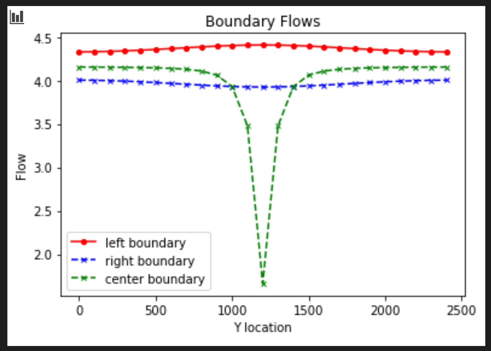
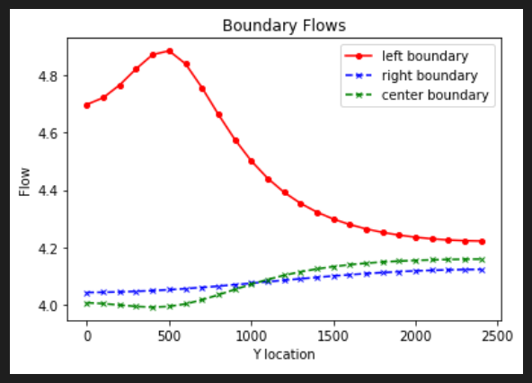

## Gillian Noonan
## HW 4 Challenge and Discussion Questions: Well, Well

## **Challenge:**
A FloPy code is provided to you that recreates the 2D homogeneous box model with constant head boundary conditions.  You will use this to explore the impact of a pumping well.

### Model Description

- Homogeneous medium with a well pumping at a constant rate.  
- Well is located at [0,10,15]
- Well is withdrawing water at a rate of -8 (note, the rate is negative to indicate water being removed from the domain).  
- You need to:
  - move the well to the center of the domain [0,12,12] and change the rate to -10.  
  - modify the location of the domain and examine the impacts on flow across the boundaries and the steady state head and drawdown distributions.    

### Noonan - Notes

 - ...

 **Things I Know or think I Know:**
 >  
  - Different well locations and pumping rates will have differing effects on equipotentials and flow vectors.  
  - Different well locations and pumping rates will have differing effects on the boundary flow for a Type 1 (constant head) condition, and differing effects on the drawdown distribution.
  - The closer a well is to a boundary or flow vector path, the higher magnitude the effect.
  - The flow vectors can be traced into the well to define the "capture zone".  This can be helpful to determine where the water you are pulling is coming from and if there are any potential ill effects from surrounding contaminated zones.

-----------------------------------
**The Process and the Key Figures:**

The process this week involved simply changing two lines of code in the Jupyter notebook to edit the well location and the well pumping rate.  And then adding a couple of lines of code to add a line to the plot of flows across the center of the model.  And then observing and analyzing what changes were produced in the resulting plots.

*Figure 1: Base case boundary flows.*

well at [0,12,12]

*Figure 2a: Base case boundary fluxes and flux through midline of domain.*

flow along a line that passes through the center of the well [:,12]

*Figure 2b: Base case boundary fluxes and flux through just upgradient of well.*

flow along a transect just upgradient from the well [:,11]

*Figure 3: Base case equipotentials and flow vectors.*

*Figure 4: Base case drawdown around centered well - simply python plot.*

*Figure 5: [0,5,5] boundary fluxes and flux through midline of domain*

*Figure 6: [0,5,5] equipotentials and flow vectors.*

*Figure 7: [0,5,5] drawdown around centered well - simply python plot.*

-------------------------------------

### Noonan - Challenge Response

***1) For the initial well location, plot the flow into the left (constant head = 20) and out of the right (contant head = 10) boundaries.  (The code, as provided, makes this plot for you.)  Explain why the values are not constant along the boundary (relate to the definition of a Type I boundary).  Explain the shapes of the flow distributions and why they are not the same for the left (inflow) and right (outflow) boundaries.***
> Answer:     This is similar to the case with the inclusion.   The Type 1 boundary tells the model that there is a constant head that cannot change.  Therefore, to adapt to what is within the model that is heterogeneous (in this case it is the well effect), the flow needs to adapt to satisfy both the well effect, and still maintain the constant head value across the boundary.  

***2) Add a series of the left-to-right flow along a line that passes through the center of the well [:,12].  How do you interpret the flow along this transect?  Hint, also look at the flow along a transect just upgradient from the well [:,11].***
> Answer:   Figure 2a and 2b show the flow through the center of the well and just upgradient from the well.  These plots are starkly different in that the flow through the center of the well decreases significantly (by ~50%).  I believe this would be due to the well pumping the water out at a rate that is slower than the flow in?  The constant head at the left boundary is 20, and the flow rate out of the well is -10.  How do these relate??

>The flow upgradient increases sharply (by around ~50%).  The water that is getting backed up at the well is now being forced up and around the well and is moving faster??

***3) Then, look at the plot of equipotentials and flow vectors.  Describe how water flows through the domain.  To aid in your description, draw a line through all of the flow vectors that terminate in the well.  This approximates the capture zone of the well. Use this to refine your description of the flow system, being as specific as possible about where water that ends up being extracted by the well originates on the inflow boundary.***
> Answer:  The equipotentials are clearly not moving straight across the profile in the area of the well (0,12,12, center of profile).  They bend towards the well and change magnitude slightly.  If you trace all flow paths to the well and draw lines, you will get the capture zone.   These lines can be traced back to the left boundary and you will see that the flow into the well is originating only from the middle of the zone between 1000-1500m.  This is a helpful modeling observation if you are trying to determine whether an area will impact your well. (ex. agricultural field nearby)
Side note:  it would be great to be able to add a point into this plot where the well is located for better visualization.  How to do that in Python?

***4) Then, look at the plan view drawdown plot.  Why aren't the drawdown contours circles?  Either explain why this is correct, or fix the plot.***
> Answer: They are not circles because there is no flow boundary on the top and bottom?  Does the gradient across the survey area have an effect?

***5) Move the well to [0,5,5].  Use all plots necessary to describe fully how water is flowing through the domain with the well in this location.  Be sure to include the drawdown plot in your discussion - compare this plot to the equipotentials and flow vectors.  Something is not right about how the well location is shown.  Fix it and explain what was wrong!!***
> Answer: In this case, we see a greater effect on the boundary flow on the left (the well is closer, so greater magnitude effect on the left).  Whereas, on the right boundary, the effect is much less.   The center boundary as well, since the well is south of center by many units.  The equipotentials look similar to the case at [0,12,12] because the pumping rate is the same, however the location of the perturbation has moved obviously.  The drawdown plot shows a higher gradient towards the left boundary where the flow is coming from.   This makes sense since the gradient (and flow) is from left to right.

> What is wrong: The left axis appears to be flipped on the equipotentials plot.   I am not sure why this would happen other than maybe the code was wrong?
--------------------------------------

### Discussion Points
**In addition to The Challenge, start thinking about the following ideas:**

You are still modeling steady state conditions?  So, what is supplying water to the well?  Why are the drawdown contours not equally spaced?
> Initial Thoughts: In order to maintain steady state conditions, the flow in would need to equal the flow out.   If the well is pulling water out, the equal amount would need to be an increase in flow in from the left side boundary?  But then doesn't that make it NOT steady state? (flow in does NOT equal flow out?)

If the right boundary represented a stream, what would the impact of the well be on the stream?  This is referred to as 'capture' - can you describe this concept in a sentence that a non-expert might understand?
> Initial Thoughts: If the right boundary represented a stream, the well would be taking water that would have ended up in the stream, thus reducing streamflow.  The well is "capturing" water that the stream would have had.  To describe simply, there is a set amount of water that will go from the left into the stream, the well will take some of that water out, so the potential streamflow will be reduced by exactly that amount.  Like if you had a keg of beer, and someone came and poked a hole in it and put a straw and started drinking it, there would be less beer for the other people pouring cups out of the spigot, haha, how's that?

Before running the model, predict what you would happen to the inflow/outflow boundary fluxes if you reduced the pumping rate to -5 with the well located at [0,12,12].  Were you correct?  If not, how were you wrong? Now predict what would happen if you increased the pumping rate to -20.  Still correct?  Now try -25.  Uh oh, what happened??
> Initial Thoughts: ...
