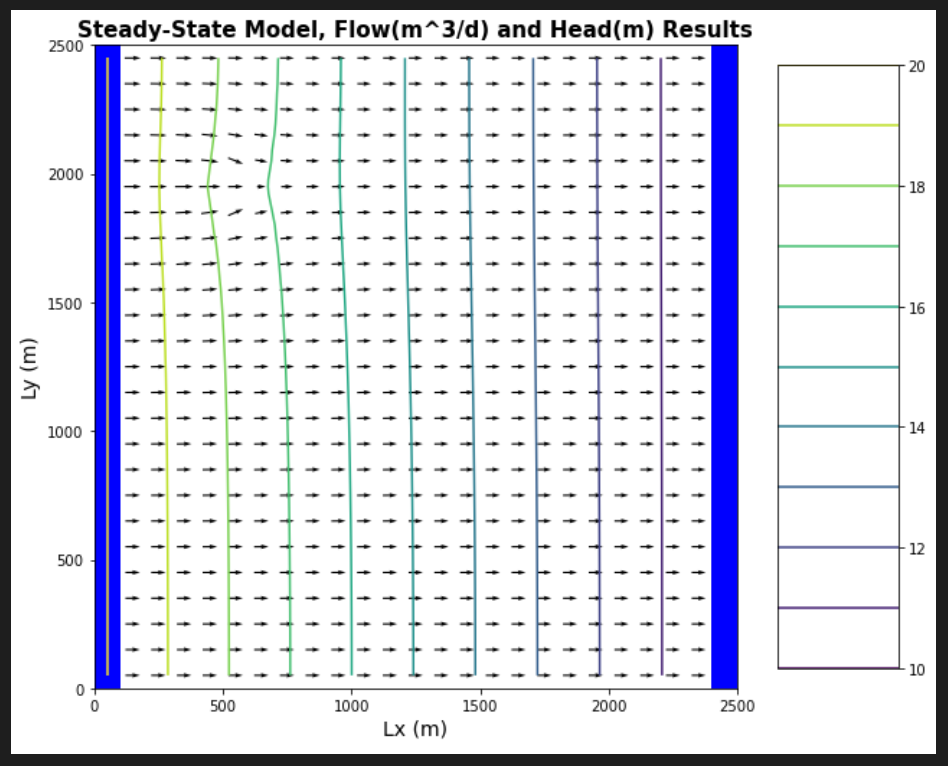

## Gillian Noonan
## HW 4 Challenge and Discussion Questions: Well, Well

## **Challenge:**
A FloPy code is provided to you that recreates the 2D homogeneous box model with constant head boundary conditions.  You will use this to explore the impact of a pumping well.

 1) For the initial well location, plot the flow into the left (constant head = 20) and out of the right (constant head = 10) boundaries.  (The code, as provided, makes this plot for you.)  Explain why the values are not constant along the boundary (relate to the definition of a Type I boundary).  Explain the shapes of the flow distributions and why they are not the same for the left (inflow) and right (outflow) boundaries.

 2) Add a series of the left-to-right flow along a line that passes through the center of the well [:,12].  How do you interpret the flow along this transect?  Hint, also look at the flow along a transect just upgradient from the well [:,11].

 3) Then, look at the plot of equipotentials and flow vectors.  Describe how water flows through the domain.  To aid in your description, draw a line through all of the flow vectors that terminate in the well.  This approximates the capture zone of the well. Use this to refine your description of the flow system, being as specific as possible about where water that ends up being extracted by the well originates on the inflow boundary.

 4) Then, look at the plan view drawdown plot.  Why aren't the drawdown contours circles?  Either explain why this is correct, or fix the plot.

 5) Move the well to [0,5,5].  Use all plots necessary to describe fully how water is flowing through the domain with the well in this location.  Be sure to include the drawdown plot in your discussion - compare this plot to the equipotentials and flow vectors.  Something is not right about how the well location is shown.  Fix it and explain what was wrong!!

### Model Description

- Homogeneous medium with a well pumping at a constant rate.  
- Well is located at [0,10,15]
- Well is withdrawing water at a rate of -8 (note, the rate is negative to indicate water being removed from the domain).  
- You need to:
  - move the well to the center of the domain [0,12,12] and change the rate to -10.  
  - modify the location of the domain and examine the impacts on flow across the boundaries and the steady state head and drawdown distributions.    

### Noonan - Notes
Does background gradient affect drawdown?
 - In a confined aquifer system, drawdown map does not depend on gradient.  We have a background flow, and we have a perturbation caused by the pumping well.   This is a Linear system - you can add these influences together and they don't affect each other.
 - Theis equation:  drawdown is a fcn of pumping rate, distance from well and, in steady state, just the transmissivity.  None of these things change becuase of the background gradient.
 - For unconfined system, background gradient would be telling us that saturated thickness is different in one direction than other, and so if we were to pump in an unconfined system, background gradient would have an impact on the drawdown
 - Drawdown, Zone of influence, capture zone, head distributions.   4 different, but related things.   
  Zone of influence and drawdown are related:  ZOI is the extent to which you see any drawdown.   Capture zone and final head contours are related:   Capture zone is those flow lines defined by the final head contours that terminate in the well.   To get capture zone, you need the head contours.  To get zone of influence, you need to know drawdown.

 **Things I Know or think I Know:**
 >  
  - Different well locations and pumping rates will have differing effects on equipotentials and flow vectors.  
  - Different well locations and pumping rates will have differing effects on the boundary flow for a Type 1 (constant head) condition, and differing effects on the drawdown distribution.
  - The closer a well is to a boundary, the higher magnitude the effect from or to that boundary.
  - The flow vectors can be traced into the well to define the "capture zone".  This can be helpful to determine where the water you are pulling is coming from and if there are any potential ill effects from surrounding contaminated zones.

-----------------------------------
**The Process and the Key Figures:**

The process this week involved simply changing two lines of code in the Jupyter notebook to edit the well location and the well pumping rate.  And then adding a couple of lines of code to add a line to the plot of flows across the center of the model.  And then observing and analyzing what changes were produced in the resulting plots.

*Figure 1: Base case boundary flows.*

well at [0,12,12]

*Figure 2a: Base case boundary fluxes and flux through midline of domain and flux through just upgradient of well..*

flow along a line that passes through the center of the well [:,12] and flow along a transect just upgradient from the well [:,11]

*Figure 2b: Base case boundary fluxes and flux through just upgradient of well.*

*Figure 3: Base case equipotentials and flow vectors.*

*Figure 4: Base case drawdown around centered well - simply python plot.*

*Figure 5: [0,5,5] boundary fluxes and flux through midline of domain*

*Figure 6: [0,5,5] equipotentials and flow vectors.*

*Figure 7: [0,5,5] drawdown around centered well - simply python plot.*

-------------------------------------

### Noonan - Challenge Response

***1) For the initial well location, plot the flow into the left (constant head = 20) and out of the right (contant head = 10) boundaries.  (The code, as provided, makes this plot for you.)  Explain why the values are not constant along the boundary (relate to the definition of a Type I boundary).  Explain the shapes of the flow distributions and why they are not the same for the left (inflow) and right (outflow) boundaries.***
> Answer:     In Figure 1 above, the boundary flows are presented for the left and right sides of the model space.  This looks similar to the case with the inclusion.   The Type 1 boundary tells the model that there is a constant head that cannot change.  Therefore, to adapt to what is within the model that is heterogeneous (in this case it is the well effect), the flow needs to adapt to satisfy both the well effect, and still maintain the constant head value across the boundary.  

Ty Feedback: You are right that the response is similar ... just be a bit more specific about WHY the well leads to this flow distribution.

> Amended Answer:  You can see that the flow is higher towards the middle of the boundary and lower to the top and bottom on the left side (flow source), and the opposite is seen on the right hand side where the flow is lower near the center of the boundary and a little higher to the top and bottom.   These curved shapes reflect the location of the well, which is pulling water from the left boundary, and capturing water that would have made it to the right boundary.   Thus the related flow increase and decrease at the center of the boundaries (well location) at the left and right boundaries, respectively.  

***2) Add a series of the left-to-right flow along a line that passes through the center of the well [:,12].  How do you interpret the flow along this transect?  Hint, also look at the flow along a transect just upgradient from the well [:,11].***
> Answer:   Figure 2a and 2b show the flow through the center of the well and just upgradient from the well.  These plots are starkly different in that the flow through the center of the well decreases significantly (by ~50%).  I believe this would be due to the well pumping the water out at a rate that is slower than the flow in?  The constant head at the left boundary is 20, and the flow rate out of the well is -10.  How do these relate??

>The flow upgradient increases sharply (by around ~50%).  The water that is getting backed up at the well is now being forced up and around the well and is moving faster??

Ty Feedback: You are on a good track.  Try thinking holistically about how flow is occurring to/into/from the well and rework your answer slightly.  For example ... is water getting backed up anywhere?

> Amended Answer:  After lecture today and thinking about tracking a flow particle, I no longer think that water is getting backed up per say, it is either going into or through the well or around the well and at different speeds, so maybe poor choice of words.   From the flow line that goes through the center (through the well) in Figure 2a, you can see that the flow decreases as it approaches the well and hits a low value of approximately 1.5 flow units at the well location.   Then the flow path increases again past the well, recovering back to the original flow value.  There is no point in which the flow goes negative (which would indicate flow coming from the right side - flow continues through the well to the right.   

> The line that shows flow just upgradient shows a flow increase just to the well and then a similar decrease to the other side of the well.   From lecture today, Ty showed a profile where a line was placed from top to bottom, and remarked that more flow vectors would be encountered along this line as they are approaching the well.   I think this is what accounts for the increased velocity - it's not just the flow from the center going around, but flow coming in from other areas of the "capture zone" toward the point of the well.

***3) Then, look at the plot of equipotentials and flow vectors.  Describe how water flows through the domain.  To aid in your description, draw a line through all of the flow vectors that terminate in the well.  This approximates the capture zone of the well. Use this to refine your description of the flow system, being as specific as possible about where water that ends up being extracted by the well originates on the inflow boundary.***
> Answer:  In Figure 3, the equipotentials are clearly not moving straight across the profile in the area of the well (0,12,12, center of profile).  They bend towards the well and change magnitude slightly.  If you trace all flow paths to the well and draw lines, you will get the capture zone.   These lines can be traced back to the left boundary and you will see that the flow into the well is originating only from the middle of the zone between 1000-1500m.  This is a helpful modeling observation if you are trying to determine whether an area will impact your well. (ex. agricultural field nearby)
Side note:  it would be great to be able to add a point into this plot where the well is located for better visualization.  How to do that in Python?

Ty Feeback: Good answer!  Combine this with #2 to intuit what is happening just outside of the capture zone, directly downgradient from the well.

> Amended Answer: Yes, I think you are talking about noticing that the flow vectors are all headed towards the well.

***4) Then, look at the plan view drawdown plot.  Why aren't the drawdown contours circles?  Either explain why this is correct, or fix the plot.***
> Answer: They are not circles because there is no flow boundary on the top and bottom.  Does the gradient across the survey area have an effect?

Ty Feedback: This is partially correct.  Just explain WHY the boundaries impact the drawdown. In answer to your question, for a confined aquifer the gradient does NOT impact the drawdown.  But, there is one more thing.  Right near the well the drawdown should be circular.  Why isn't it on your plot??

> Amended Answer:  This one is still a little fuzzy for me, even after re-listening to the lecture.  Facts: The boundary restricts the flow (to zero from that direction).  The "circles" are stretching vertically and compressed horizontally.  All flow is coming from the left to the right.   No flow is coming from the top.  Conceptually i understand that this means there is no source of water coming from the top and bottom of the profile, only the sides.  So the drawdown is stretched to the right and left becuase that is a higher source of flow?  If we had an unconfined aquifer, the drawdown would be circular, with flow coming equally from all around the well, radially.      

***5) Move the well to [0,5,5].  Use all plots necessary to describe fully how water is flowing through the domain with the well in this location.  Be sure to include the drawdown plot in your discussion - compare this plot to the equipotentials and flow vectors.  Something is not right about how the well location is shown.  Fix it and explain what was wrong!!***
> Answer: In this case, we see a greater effect on the boundary flow on the left (the well is closer, so greater magnitude effect on the left).  Whereas, on the right boundary, the effect is much less.   The center boundary as well, since the well is south of center by many units.  The equipotentials look similar to the case at [0,12,12] because the pumping rate is the same, however the location of the perturbation has moved obviously.  The drawdown plot shows a higher gradient towards the left boundary where the flow is coming from.   This makes sense since the gradient (and flow) is from left to right.

> What is wrong: The left axis appears to be flipped on the equipotentials plot.   I am not sure why this would happen other than maybe the code was wrong?

Ty Feedback:  Good thinking on the boundary fluxes.  Can you think of a way to compare the results for the centered and non-centered wells QUANTITATIVELY?  Good that you caught the 'flip'.  To answer this, think about how matrix rows are defined in python versus MODFLOW.  Keep this in mind if you make your own plots (not using the built-in FloPy utilties)!

> Amended Answer:  I'm thinking the answer here on how to compare quantitatively might be the example discussed in the bonus assignment below - what does the area within the curves mean?  

> For the plot fix - I now know it has to do with how Modflow/FloPy (bottom to top) count rows versus how matplotlib/Python counts rows (top to bottom).  I tried to fix this by inverting the axes (looked up a line of code (plt.gca().invert_yaxis()).   However, it messes up the flow vectors.  Now they appear to be going around the well instead of towards the well.  What gives???

***Bonus) From lecture:  Add in flow line without a well present (make well rate 0).    What is area under the line versus area above that line and what does this tell you about how the well is interacting with the domain and boundaries depending on where it's located?***

> Answer:  This part of what Luis was explaining really did not totally click with me, even on second viewing, but i have a slight grasp on it perhaps.  He stated that the area inside the curves represented the pumping rate?  And you could verify this by adding up each flow value for each cell in some way.  Also, when i tried to add the well into the code with a rate of zero, it did not produce the anticipated result, therefore it is handdrawn below and estimated around the middle of the two flow lines from original example with well in middle.  I think the biggest takeaway here is to notice the level of deviation from "no well" line.   The deviation is highest closest to the well (highest drawdown effect?) and lowest farther from the well.  

--------------------------------------

### Discussion Points
**In addition to The Challenge, start thinking about the following ideas:**

You are still modeling steady state conditions?  So, what is supplying water to the well?  Why are the drawdown contours not equally spaced?
> Initial Thoughts: In order to maintain steady state conditions, the flow in would need to equal the flow out.   If the well is pulling water out, the equal amount would need to be an increase in flow in from the left side boundary?  But then doesn't that make it NOT steady state? (flow in does NOT equal flow out?)

If the right boundary represented a stream, what would the impact of the well be on the stream?  This is referred to as 'capture' - can you describe this concept in a sentence that a non-expert might understand?
> Initial Thoughts: If the right boundary represented a stream, the well would be taking water that would have ended up in the stream, thus reducing streamflow.  The well is "capturing" water that the stream would have had.  To describe simply, there is a set amount of water that will go from the left into the stream, the well will take some of that water out, so the potential streamflow will be reduced by exactly that amount.  Like if you had a keg of beer, and someone came and poked a hole in it and put a straw and started drinking it, there would be less beer for the other people pouring cups out of the spigot, haha, how's that?

Before running the model, predict what you would happen to the inflow/outflow boundary fluxes if you reduced the pumping rate to -5 with the well located at [0,12,12].  Were you correct?  If not, how were you wrong? Now predict what would happen if you increased the pumping rate to -20.  Still correct?  Now try -25.  Uh oh, what happened??
> Initial Thoughts:

> - Before running (reduced to -5):  I think the equipotential flow vectors would calm down a bit since the flow is lower.  Meaning less fluctuation in speed towards the center where the well is.
  - after running: It looks like the capture zone does appear somewhat smaller.

> - Before running (reduced to -20):  Now you are pulling more water out so I think the equipotential flow vectors would become more perturbed, faster flow and wider capture zone.  
  - after running: As expected, the perturbation zone, and therefore capture zone, is much larger.

> - Before running (reduced to -25):  I would think that this would just have a slightly larger effect on the capture zone (increase) than the previous model.  But i'm guessing that's not the case based on the "uh-oh" comment above!  
  - after running: Well, the downgradient flow went to zero at the well.  Left, right, and cetner flow lines are straight lines.  I think the pull on the well is exceeding the flow into the system?  But if that was the case, i would maybe expect the flow vectors to be coming from both sides.   Near the well, the head varies from 0 to -1.  The plan view drawdown is a little tight circle (well, diamond).  I am perplexed!!   Did it just suck all the water out?

  
  
  
