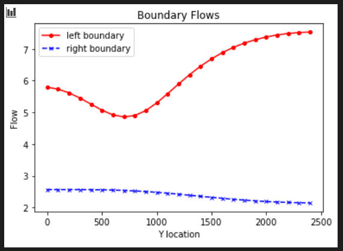
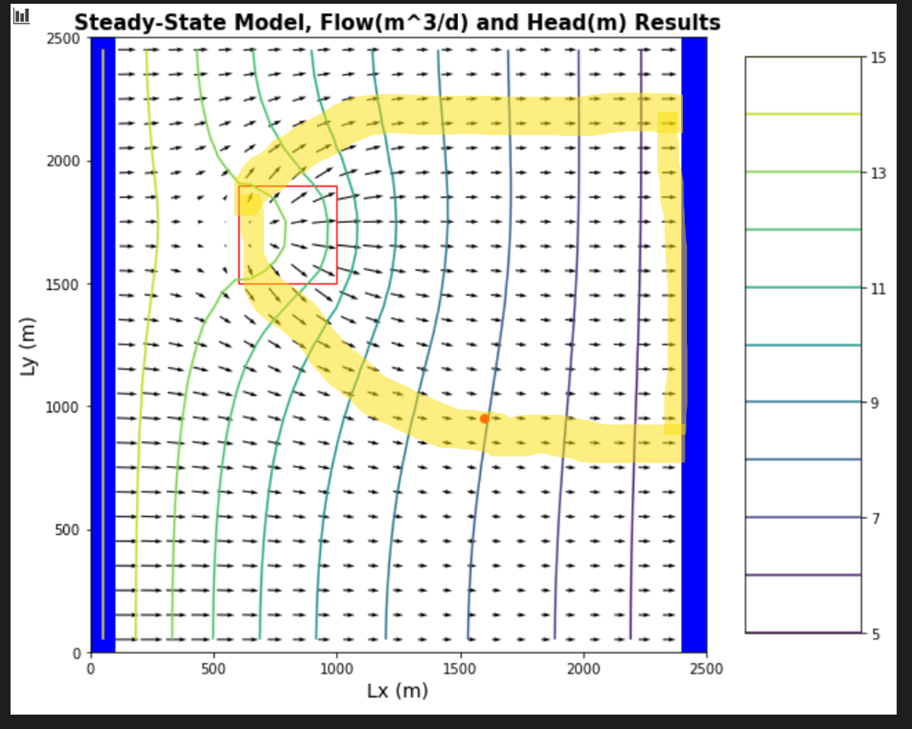
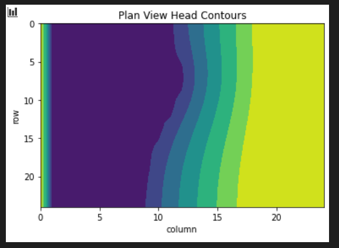
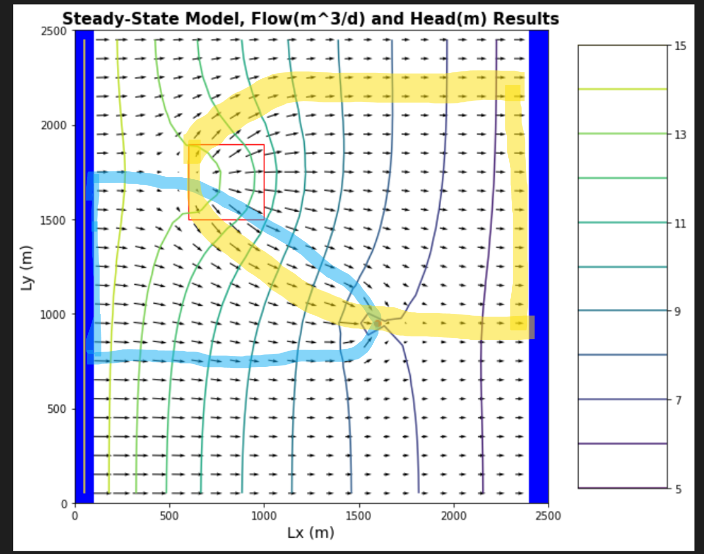
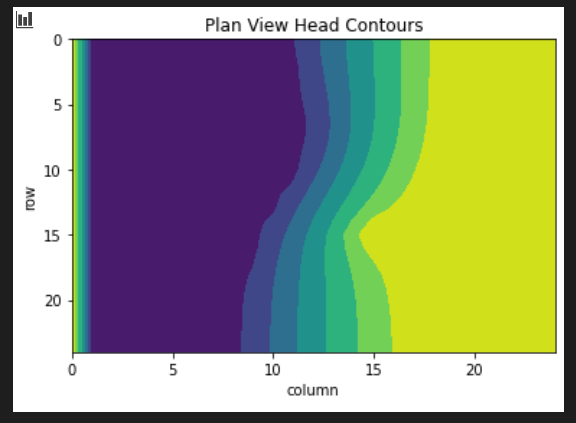

## Gillian Noonan
## HW 6 Challenge: Transpired

## **Challenge:**
A flopy code is provided that recreates the 3D homogeneous box model with constant head boundary conditions.  The aquifer is now defined as unconfined.  Use this to explore the combined impacts of recharge, ET, and pumping on an unconfined aquifer.

### Model Description
Initial conditions:
- Homogeneous medium.  
- Unconfined aquifer, recharge package added.
- NEW WELL LOCATION: Well is located at [0,15,15] - well not pumping
- Background recharge rate is 0.  There is a region of localized recharge in [6:10, 6:10] - in python terms - with a recharge rate of 5e-4 m/day
- ET occurs over the entire domain at a rate of **5e-5** m/day and an extinction depth of 3 m.
- Left and right constant head boundaries = 15, 5

You need to:
- Show equipotentials and flow vectors, and plot of steady-state ET flux (how is ET varying over the map) for initial conditions.  
- One person to play around with extinction depth and see what difference that makes in the model.
- Other person to explain conceptually the difference between how ET is being modeled in MODFLOW versus how it works in real life
- Collective final challenge, start the pumping and examine how pumping affects ET in the MODFLOW model.  If we know the well's pumping rate and how much water is coming in from infiltration and from the boundary, how do we include ET in the mass balance of the well. Give a complete mass balance for the well that includes all sources of water, including boundary, irrigation water (recharge) and how you account for ET.

### Noonan - Notes

- Evaporation:
  - Evap from subsurface - how does it change with depth?  Max potential evap at ground surface and decreases with depth - harder to evaporate deeper because lower temperature.   Soil is very humid (~99 relative humidity in most cases).  Deeper in the soil, there is essentially no evaporation, it drops off very sharply at the surface.  This is in real life - however, MODFLOW just assumes it decreases linearly with depth.  
  - Extinction depth - no evaporation below that depth.  Serves as a cutoff for MODFLOW to apply evaporation to cells - below that depth, no evap applied to cell.  
  - "how much water is leaving your domain by evaporation - domain starts at the water table"
  - confined aquifer - no evaporation at all
  - How to put in MODFLOW model:  Roll it all into recharge value (precip, evap, transpiration, etc.) - MODFLOW only does groundwater - all of this stuff happens above the boundary of our model, so we have to do that calculation off to the side.

- Transpiration:
  - How to represent in subsurface model? Represent the root to soil continuum, the roots are outside of your domain.  The boundary condition would be water flowing out of soil into root.   To represent, would need to define constant pressure head, known pressure head, or known flux for EVERY ROOT.  This is not reasonable for a basin-scale model.  Instead, we use sink term to represent all plants in model per cell - either per time step, or every time-step for steady-state, we define how much water goes into the roots - in MODFLOW this is diffuse throughout the cell, water magically disappears.
  - How this uptake should be applied? Change in rate with depth - MODFLOW again uses extinction depth and transpiration rate is linear with extinction depth.  So we set a transpiration rate for plants, set an extinction depth, and below that there is no transpiration.  Basically we are modeling tap roots (what is taking water from the system).
  -  Reasons to be wary of this representation in models: Values depend on model resolution - get to pick one number for your model.  Does not mimic actual root density per depth - not linear in real life.  Root uptake depends on water pressure (degree of wetness or dryness in soil).

-   MODFLOW Evapotranspiration package: https://water.usgs.gov/ogw/modflow/MODFLOW-2005-Guide/index.html?evt.htm
   - The Evapotranspiration package is used to simulate a head-dependent flux out of the model distributed over the top of the model and specified in units of length/time.  Within MODFLOW, these rates are multiplied by the horizontal area of the cells to which they are applied to calculate the volumetric flux rates.
   - Recharge is sometimes calculated as precipitation minus losses between the land surface and the water table. Evapotranspiration from the unsaturated zone would be one such loss.
    - ET variables (ET surface, maximum ET rate, and extinction depth) are specified in layer variables, SURF, EVTR, and EXDP, with one value for each vertical column. Accordingly, ET is calculated for one cell in each vertical column. The option codes determine the cell within a column for which ET will be calculated.

      -	1—ET is calculated only for cells in the top grid layer.
      -	2—The cell for each vertical column is specified by the user in variable IEVT.
      -	3—Evapotranspiration is applied to the highest active cell in each vertical column.

### The Process and Key Figures

#### Team partner: Dalia

Sunday discussion with Dalia:

I led the discussion for the conceptual idea of how evaporation and transpiration occur in real life, and how MODFLOW models these things.   We used my above notes as a starting point.  In summary, we agree that MODFLOW is a very general representation of these events and that the model will never accurately represent the fine tuning of real life ET processes.  

Dalia led the discussion on how changing the extinction depth affects the model results.  We tested a number of values.  Tested 0 - model did not converge.   Discussed "what do you think is the smallest number that would work for the model?""  We thought anything larger than zero.  So we tried .001, It still did converge!  Thought maybe the model needs to have the numerical format different, so we tried 5e-5.  No go.  Thought model needs an integer, so we tried 1.  This worked.  We also tried 3, 5, 10 and 15 and looked at resulting plots of head, ET distribution, and flow distribution.  We discussed how the gradient changed for ET over the models with different extinction depths and how this might relate to the discussion on head gradient from HW5 with the change from confined to unconfined parts of the model with heads at 15,5 and aquifer thickness of 10.

We then discussed number 3 and talked about how to calculate flow over an area and arrive at Darcy flux values.   We agreed to work on this on our own and meet back tomorrow afternoon/evening.

#### Key Figures

Flow along fixed-head boundaries for initial conditions

Equipotentials and flow vectors in plan view and outlined area affected by recharge

Steady-state ET flux (how is ET varying over the map) for initial conditions (Extinction depth = 3)

Equipotentials and flow vectors in plan view and outlined area affected by recharge + Pumping

-------------------------------------

### Noonan - Challenge Response

***1) For the initial boundary head values and recharge and ET rates, establish the flow versus y-distance along the left (15 m) and right (5 m) boundaries.  Plot the equipotentials and flow vectors in plan view and outline (hand draw) the area that would be affected by recharge (i.e. if it were contaminated).  Also show a contour plot of the steady state ET flux in plan view.***
> Answer:
See Key figures X and X above.

>

***2) Change the extinction depth.  What impacts does this have?***
> Answer:  Figures and discussion to come...

***3) Explain, conceptually, how MODFLOW is representing ET.  How does this compare to your intuitive understanding of ET in the real world?***  
> Answer:  

>MODFLOW assumes ET decreases linearly with depth.  To represent ET in MODFLOW, you give the model 3 variables representing ET surface, ET rate, and extinction depth (depth below which no ET applied to cells).  These layer variables are SURF, EVTR, and EXDP, and are assigned one value per vertical column.  The Evapotranspiration package is used to simulate a head-dependent flux out of the model distributed over the top of the model and specified in units of length/time.  Within MODFLOW, these rates are multiplied by the horizontal area of the cells to which they are applied to calculate the volumetric flux rates.

> In the real world, the maximum potential evaporation is at ground surface and decreases with depth very sharply, Not linear, but is dependent on variable such as temperature (which decreases sharply with depth, making evaporation harder, vapor pressure, and soil moisture content).  Similarly, in the real world, transpiration is not linear with depth.   Root uptake depends on factors such as root density per depth, and water pressure.  

***4) Now start the well pumping, extracting 20 m3/day.  How does the well change the zone that is affected by the recharge area?  How does it affect the ET map?  Write a mass balance for the well - how much water is coming from a boundary?  How much is originating as recharge?  How do you account for the impact of ET on this mass balance?  At steady state, what are the effects of 'capture' by the well?***
> Answer:  See key figure X above for zone affected when well starts pumping.  See figure below for how affects the ET map.

>Mass balance: Still working on this one but i know that: The Evapotranspiration package is used to simulate a head-dependent flux out of the model distributed over the top of the model and specified in units of length/time.  Within MODFLOW, these rates are multiplied by the horizontal area of the cells to which they are applied to calculate the volumetric flux rates.

> FROM HW5
Ty Notes:  Remember that the well is pumping at 8 m3/d ... so, you can calculate the flow
into the boundary by differencing.  Alternatively, you need to plot the flow
rate (consistent units, m3/d) versus y location and estimate the length of the
boundary that is captured.  You can then sum the inflow over that area.  

> The farm is 400x400m = 160,000 m2. The recharge rate is 1e-4 m/day.  So the flow would be 160000x1e-4 = 16m3/day??

> However, we are only overlapping with approximately 1/6 of that area for the well capture zone (~27,000m2), so the flow contribution to the well would be 16/6 = ~2.7m3/day?

> Then, from the model results, the flow in at the left boundary within the capture zone is approximately 3.4 at y=1500m (m3/day?? what are units? would be good to have those on the plot in python).  Let's estimate that total area for the inflow zone to be 250x10m = 2,500m2, which is significantly smaller area than the recharge zone.   However, the flow is much larger.   I'm not really sure how to relate that 3.4 value to the assumed area, like what is that 3.4 actually representing spatially??
--------------------------------------
