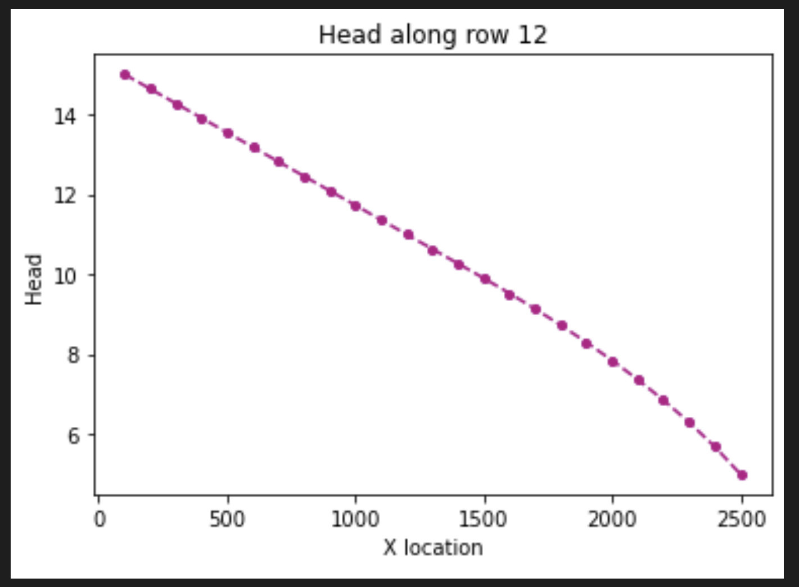
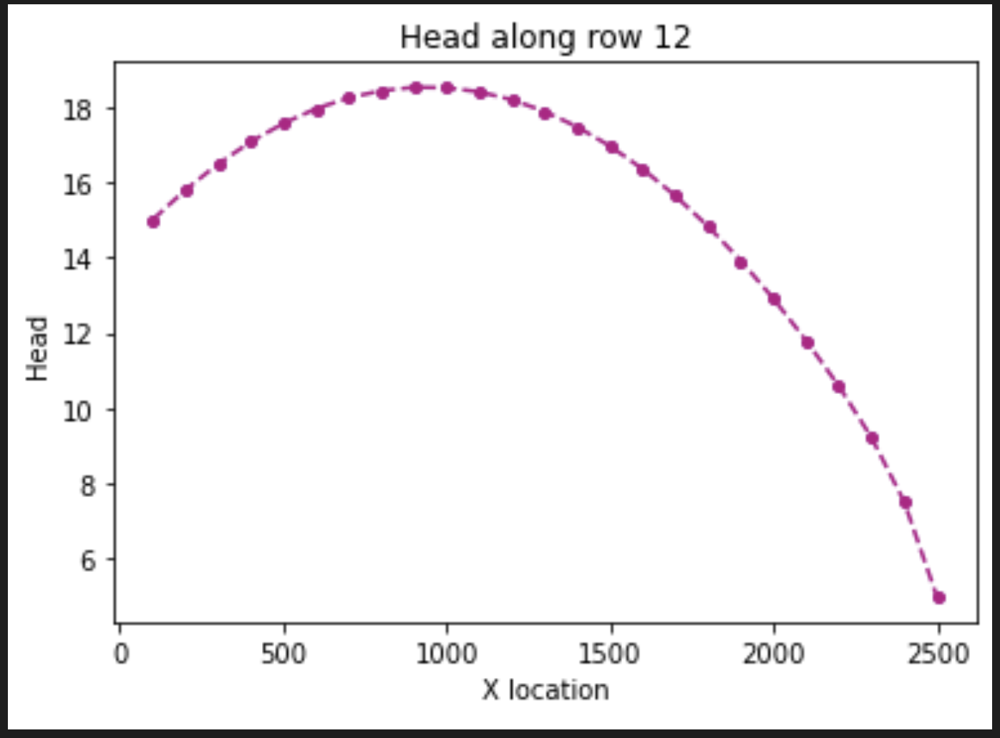
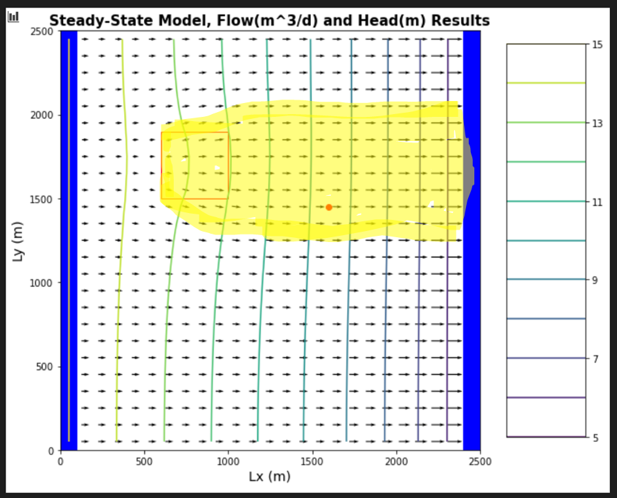
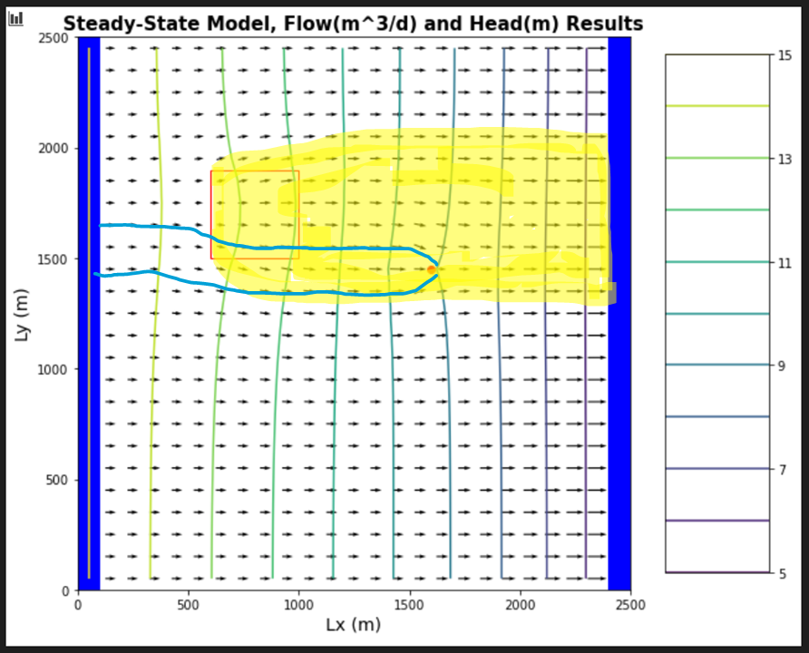

## Gillian Noonan
## HW 5 Challenge and Discussion Questions: Recharge Me

## **Challenge:**
A flopy code is provided to you that recreates the 3D homogeneous box model with constant head boundary conditions.  The aquifer is now defined as unconfined - it was confined for the BoxModel simulations and the recharge package has been added.  You will use this to explore the impact of recharge into an unconfined aquifer.  

### Model Description
Initial conditions:
- Homogeneous medium.  
- Unconfined aquifer, recharge package added.
- Well is located at [0,10,15] - well not pumping
- Recharge rate is 0.
- Left and right constant head boundaries = 20, 10

You need to modify the model to:
  - Reduce boundary heads to 15 and 5.  
  - Add recharge at a constant rate of 1e-4 m/day over the entire top boundary.  
  - Model a system with zero recharge except for a farm located in [6:10, 6:10] - in python terms.  Recharge beneath the farm is 1e-4 m/day due to excess irrigation.  
  - Start the well pumping at a rate of 8 m3/day.  

### Noonan - Notes

 **Things I Know or Think I Know:**

 Lecture Notes:
>  - Building on model to implement recharge with MODFLOW
  - unconfined aquifer conditions are what makes sense for recharge (convertible cells in MODFLOW - convert between confined and unconfined on the fly)
  - Starting well is zero pumping and recharge is 0 - in this way, equals the basic homogeneous box model.
  - Change head to 15 and 5 (take off 5 on each end):  What will that response look like?
    - slope will be the same: gradient same, K same, same flow through system
    - However - aquifer thickness is 10.  Second case will have an unsaturated zone.  Flow only takes place through saturated part of aquifer.  Aquifer thickness cut in half - transmissivity also halved.  On right hand side, it's harder for water to flow through, but same amount needs to flow through (steady state), so what does this say about gradient on left versus right?   Gradient on right needs to be steeper to account for flow, but still needs to meet point 15 on left and 5 on right for constant head conditions - THUS, the gradient becomes curved across the model instead of constant decrease.
  - In two cases of 20, 10 and 15, 5: K is same, gradient is decreased, so flow must also be decreased.  Transmissivity is changing because saturated thickness is changing.
  - we don't know what the head distribution is until we know the saturated thickness.   But we don't know the head distribution until we know the saturated thickness.   Non-linear path.  All we know is it will be a curve.  Complicated because part of aquifer is confined, other part is unconfined.   The top portion will be linear because it's still confined, then becomes non-linear at water table, where slope continually increases to boundary because thickness is continually decreasing.   Rate of decrease depends on head needed to establish the steady-state flow.
  - Recharge is flux of water across the water table.  Recharge = P-ET (for steady state).  

  For model with confined and unconfined zones:
  >- Equipotential surface at water table, where head is zero, acts as no-flow boundary.  For MODFLOW to handle it, it converts the cell (thickness of layer to closest layer thickness dependent on water table elevation (for unconfined acquifer).   
  -  It's a Non-linear problem: Don't know water level until solve flow problem, don't know how to solve flow problem until we know what the thickness is.  Have to guess water table elevation, solve flow problem for that distribution of transmissivities.   Do we end up with head distribution that we assumed to start with?  if no, adjust head and solve again until head distribution gives us the transmissivity that, coupled with that head distribution or gradient, ends up in steady state flow conditions.

- Think in terms of how will changes affect model:
>  - recharge: why does it look different?  If i add recharge, what's going to happen?

- Recharge in the form of excess irrigation from a farm (square area in middle of domain) - look in plan view and try to understand where recharge is going.  Draw which areas might be contaminated from farm.

-  Recharge effect on head -
  - reduced gradient on left (less water in ) -  increased gradient on right (more water out), ponded water so saturated thickness is higher.  
  - size of curve depends on how much water is being added. Enough water can even change direction of gradient (push out both sides)

-----------------------------------
**The Process and the Key Figures:**

Required (key) figures for RechargeMe assignment.

1. H vs x for no pumping, no recharge, Hleft = 15, Hright = 5.

2. Add uniform recharge over entire surface.  Same plot.

3. Add localized recharge [ farm at 6:10, 6:10], show map view of heads and flow vectors and highlight impacted area.

4. Just like #3, but with the well turned on at a rate of -8 m3/d.

-------------------------------------

### Noonan - Challenge Response

***1) For the initial boundary head values and pumping and recharge rates, compare the head versus x distance - along a transect from the middle of one constant head boundary to the other - to the results for the BoxModel.  Now reduce the boundary heads to 15 and 5.  Compare this result and explain any observed differences.  The overall gradient is the same, as is the K of the medium ... is the flow the same for both boundary conditions?  Why or why not?***
> Answer:      

***2) Now add recharge at a constant rate of 1e-4 m/day over the entire top boundary.  Explain the head transect and boundary flows.  Is flow in this system 2D or 3D?  Is it represented as 2D or 3D?  Explain what you mean by your answers..***
> Answer:   

***3) Now model a system with zero recharge except for a farm located in [6:10, 6:10] - in python terms.  Recharge beneath the farm is 1e-4 m/day due to excess irrigation.  First, calculate the annual excess irrigation, in meters, that has been applied to the farm.  Second, assuming that the crop is cotton, it is located in southern Arizona, and cotton is grown all year (for simplicity), calculate the total irrigation rate on the farm that would be associated with this amount of excess irrigation.  Finally, identify the area within the domain that might be subject to contamination if the recharge water was somehow tainted.***
> Answer:  

***4) Lastly, start the well pumping at a rate of 8 m3/day.  Using one color, identify the capture zone of the well.  Using a second color, show the area that might be contaminated by the irrigated farm fields.  Comment on the impact of the well on the pattern of potential contamination.***
> Answer:

--------------------------------------

### Discussion Points
**In addition to The Challenge, start thinking about the following ideas:**

How can MODFLOW, which does not model unsaturated flow, represent an unconfined aquifer?
> Initial Thoughts:

What do you think would happen (in MODFLOW) if you pumped an unconfined aquifer so hard that the water level dropped below the bottom of the aquifer?  Explain this from the point of view of what is happening in the model ... then think about what would happen in real life!
> Initial Thoughts:

How will the steady state capture zone of a model with recharge different from that in the same model without recharge?
> Initial Thoughts:

What is recharge?  What does it mean to define recharge for a MODFLOW model?  How is it related to defining ET and precipitation?  Where, exactly, is the top boundary of the model?
> Initial Thoughts:
